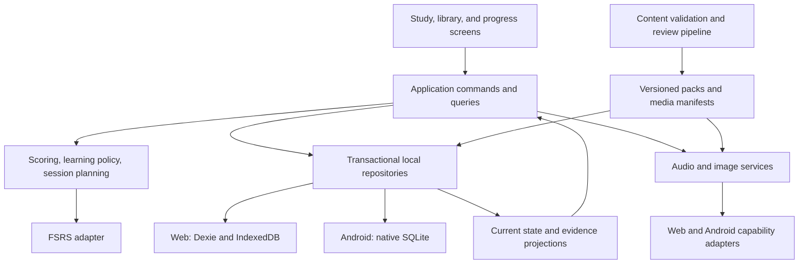
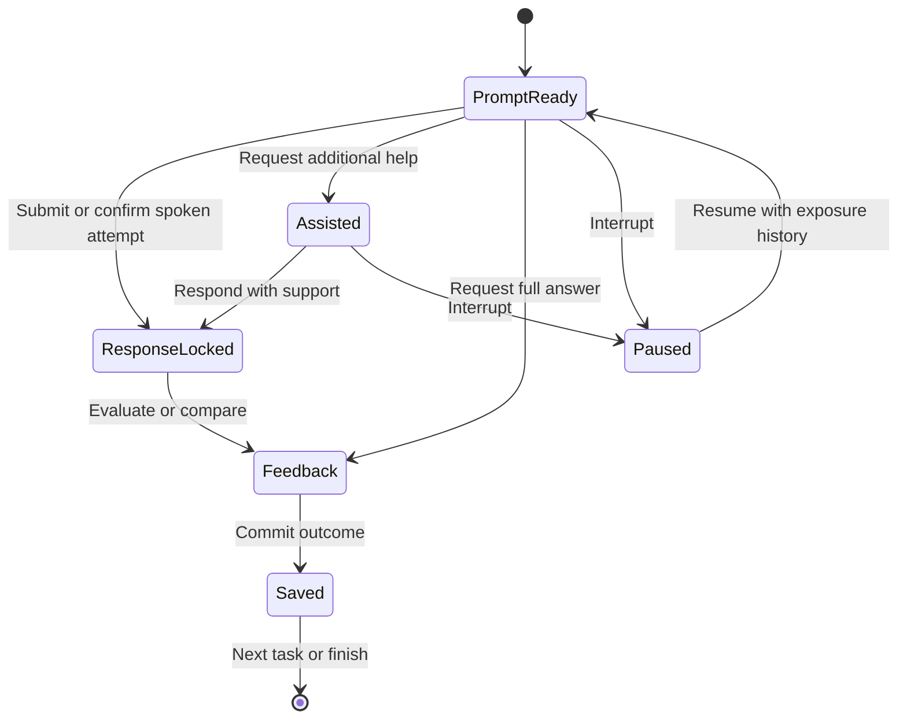

# Woorden: full product architecture and implementation blueprint

**Prepared:** 2 October 2026  
**Revision:** 2 — required PWA + Android delivery; AI tutor deferred  
**Audience:** Claude Code and the human implementing/reviewing the application  
**Repository:** https://github.com/iamsergeyka/woorden  
**Verified baseline:** `e66ad1551a91ee31fe354a33a03cbfff4a66030d`; GitHub `main` was checked against this commit on 2 October 2026.  
**Status:** implementation specification and design decisions; no application changes have been made by this document.

This is the full implementation specification for a non-AI-integrated vocabulary application delivered as both an installable PWA and a Capacitor Android app. Both targets are required from the foundation milestones. The phases are an implementation sequence, not permission to stop after a minimal release. Complete F01–F14 and the required work packages; future connected services are explicitly outside the current implementation.

**Current scope decision, 2 October 2026:** no embedded AI tutor, LLM API calls, model-generated responses at runtime, remote speech recognition, MCP server, AI-provider sign-in, or paid AI dependency. Reviewed text/images/audio prepared outside the app may be imported as ordinary content. Local audio playback, on-device TTS where available, and local recording remain in scope. Human-written mnemonics and personal images remain core features.

**Companion design:** [Woorden-future-voice-tutor-connector-design.md](Woorden-future-voice-tutor-connector-design.md). It describes future subscription-based voice practice inside ChatGPT/Claude. Its roadmap is not an instruction to build or activate that integration now. Implement only the small provider-neutral preparation specified in section 20.2 here.

Revision changes: Android moved from optional E04/W46 into F14 and M0–M11; Dexie and native SQLite now implement one repository contract; native files/reminders and Android lifecycle have explicit owners; one backup format transfers data between separate installations; signed AAB/APK preparation and Play internal testing have release gates. Prior scientific and learning requirements remain in force.

**Navigation**

- [Claude Code instructions](#1-instructions-for-claude-code), [scope](#2-product-intent-and-full-scope), and [current application](#3-current-application-and-migration-constraints)
- [Architecture decisions](#5-architecture-decisions), [module layout](#6-system-boundaries-and-repository-layout), and [data contracts](#7-domain-model-and-stable-identity)
- [Learning flow](#9-learning-experience-and-state-transitions), [scoring](#10-scoring-hints-and-task-contracts), [scheduler](#11-fsrs-integration-and-early-learning), and [time policy](#12-time-study-days-and-eligibility)
- [Content system](#14-full-content-system), [audio](#15-audio-recording-and-speech-assistance), and [interface](#16-interface-accessibility-and-learner-control)
- [Migration and backups](#17-persistence-backups-and-legacy-migration), [PWA and Android delivery](#18-pwa-and-android-delivery-and-asset-lifecycle), and [future extension boundaries](#20-future-extension-boundaries)
- [Acceptance tests](#22-test-strategy-and-concrete-acceptance-cases), [implementation milestones](#24-implementation-milestones-and-work-packages), and [configuration](#25-central-configuration-registry)
- [Worked scenarios](#26-end-to-end-worked-scenarios), [completion and kickoff prompt](#27-completion-criteria-and-final-report), and [sources](#28-source-register-and-design-boundaries)

## 1. Instructions for Claude Code

Read this document completely before changing the repository. Then read the repository's actual instructions and inspect its current state. If the baseline has changed, preserve new work and record the differences before applying this design. Do not overwrite an existing implementation with an assumed blank scaffold.

Implement the full required product in the milestones in section 24. Maintain a task ledger with requirement IDs, status, tests, and remaining dependencies. Complete each coherent milestone with meaningful verification and a reviewable commit. Continue to subsequent milestones rather than stopping after scaffolding, an initial learning loop, or a small sample deck.

Use the architectural decisions here as defaults. Resolve routine details autonomously. Record a short architecture decision when an actual repository constraint requires a material deviation. Ask only when a decision changes the user's intended product, loses data, incurs unapproved external cost, or requires unavailable credentials. Finish independent work around any such dependency.

The scientific discussion informs behavior; it does not authorize diagnosing the learner or presenting proposed numerical settings as proven optima. The application must distinguish actual evidence of recall from answer exposure, hints, recognition, spelling, and audio-system failures.

Deliver working software, migration tools, versioned content, automated verification, operating documentation, and a final implementation report. Identify imported draft content awaiting language review and signing/distribution prerequisites. Future connected features are deferred, not unfinished current work. Do not label placeholders, fake audio, stubbed providers, simulated sync, or unreviewed generated material as complete production features.

Do not publish or enable paid services merely because this plan describes them. Prepare deployable artifacts and workflows; use the user's deployment authorization when available. Preserve the MIT license and attribution from the original repository.

## 2. Product intent and full scope

The product helps a learner who experiences substantial difficulty recalling unfamiliar Dutch words. The initial learner speaks Polish and English and benefits from a low-friction, interruption-tolerant experience. This is a design context, not a diagnosis of a particular memory mechanism.

The intended outcomes are:

1. Learn the meaning and sound of a useful Dutch word or phrase with appropriate support.
2. Retrieve it with progressively less external help across genuinely separated attempts.
3. Understand and produce it in relevant contexts, not only recognize a familiar flashcard.
4. Keep the daily workload manageable even after missed days or repeated failures.
5. Retain ownership of history, custom content, and backups without requiring an account.
6. Make progress understandable without suggesting that one correct answer means permanent mastery.

### 2.1 Required full product

| ID | Capability | Completion means |
|---|---|---|
| F01 | Supported acquisition and relearning | Teaching, optional hooks, recorded attempts, graduated help, spaced checks, and item repair work together |
| F02 | Multiple learning skills | Productive recall, receptive recall, listening, article, spelling, verb forms, and contextual use have defined task and scoring contracts |
| F03 | Scheduling | A maintained FSRS adapter, early learning steps, calendar-aware daily reviews, workload planning, and accurate interval previews |
| F04 | Curriculum and selection | Useful core content, themes, difficulty metadata, personal words, configurable goals, and handling of observed confusions |
| F05 | Memory supports | Optional image, sound association, morphology, cognate, personal association, and contextual supports with clear provenance |
| F06 | Language experience | English and Polish interface/explanations; independent translation preferences; original Russian content preserved |
| F07 | Speech and listening | Reviewed audio, offline audio packs, suitable device TTS and optional local recording/playback; no runtime AI/transcription service |
| F08 | Content tooling | Schemas, extraction, validation, external-draft import, review queue, versioned packs, media manifests, and coverage reports |
| F09 | Progress and adaptation | Honest delayed-recall measures, per-skill evidence, burden controls, item diagnostics, and optional personal comparisons |
| F10 | Data integrity | Equivalent Dexie/IndexedDB and native SQLite transactions, immutable IDs, review history, undo, cross-platform import/export, and recovery |
| F11 | Offline operation | Installable PWA and bundled Android app, verifiable offline readiness, media management, safe updates, and storage-failure handling |
| F12 | Accessibility and resilience | Keyboard/screen-reader support, zoom, reduced motion, interruption recovery, and physical-device verification |
| F13 | Maintainability and delivery | Modular source, automated tests, CI, reproducible builds for both targets, deployment instructions, and documented operational boundaries |
| F14 | Android delivery and native capabilities | Capacitor app with native SQLite/files, lifecycle handling, opt-in approximate local reminders, portable backups, signed-release workflow and Play internal-testing runbook |

### 2.2 Deferred extensions and scope precedence

| ID | Extension | Current disposition |
|---|---|---|
| E01 | Account-based cross-device synchronization | Future design retained in section 20.1; do not build a backend or account UI now |
| E02 | External subscription-based voice tutor | Separate companion design; only provider-neutral data contracts now |
| E03 | Web Push reminders | Deferred; native local reminders and in-app routine cues are included in F14 |
| E04 | Former optional Android wrapper | Retired as an extension; mandatory F14 replaces it |

Required current scope is F01–F14. Deferred W41–W45 are not completion gates; W46 is retired and replaced by required Android work. Do not implement a disabled AI integration and call it non-AI: no provider SDK, token handling, hidden remote inference, or AI settings screen belongs in the current shipped application. Development with Claude Code is independent of runtime product integration.

## 3. Current application and migration constraints

The current application is primarily a single `index.html`, with the seed data, CSS, interface, scheduling, persistence, and drills in that file. There is no existing package/build/test structure to preserve. The repository also contains a README, MIT license, and screenshots.

Verified baseline facts:

- 1,946 seed entries; 1,911 with the default exclusion of 35 slang entries.
- 169 entries have examples; example translations are absent.
- 1,005 full-deck nouns have articles; the default deck has 993, of which 712 use `de` and 281 use `het`.
- 163 entries have conjugation metadata. Do not equate this count with 163 genuinely irregular verbs.
- 191 entries belong to the farming/agriculture theme.
- Seed IDs are generated from list positions, `s0`, `s1`, and so on.
- Existing progress is `{box, due, reps, lapses}` and does not preserve a complete review log or separate directions.
- Storage keys include `woorden.progress`, `woorden.settings`, `woorden.meta`, and `woorden.custom`.
- The exported v1 backup is `{v:1, exported, progress, settings, meta, custom}`. It does not identify the seed revision.
- The current settings include `dailyNew`, `reverse`, `lang`, and `slang`.

Map the old implementation to the new modules:

| Existing area | New owner |
|---|---|
| `SEED`, `loadDeck()` | Content extractor, immutable content packs, catalog repository |
| `rate()`, `INTERVALS` | Scheduler adapter and learning policy |
| `buildQueue()`, `buildExtraQueue()` | Session planner and practice service |
| `renderCard()`, `handleRate()` | Study UI and attempt command handlers |
| `TTS`, `speak()` | Audio capability and playback service |
| `drillAnswer()`, `cdMark()` | Article/verb task definitions and graded attempts |
| `exportData()`, `importData()` | Validated backup and migration services |
| `STR`, `trMain()`, `trSub()` | Interface localization and independent learning-language preferences |

Preserve a baseline fixture of the original seed and export format before any reordering. Copy the old application to a clearly marked legacy reference location if useful for comparison, but do not let two production interfaces silently maintain independent progress stores.

## 4. Scientific principles and configurable hypotheses

The strongest foundation is retrieval with corrective feedback and spaced later practice. Associations and images are supports whose usefulness depends on the item, task, and learner. Transfer between receptive knowledge, production, and listening must be measured rather than assumed. [R1–R4]

Implement the following distinctions:

| Term | Operational meaning |
|---|---|
| Recognition | Selecting or identifying an answer already present among alternatives |
| Receptive recall | Seeing/hearing Dutch and generating its meaning |
| Productive recall | Generating Dutch from a meaning, picture, or situation |
| Primary cue | Information intentionally included in the task definition |
| Additional assistance | Extra information requested or exposed after the intended prompt |
| Unaided correct | Correct first committed response using the primary cue only |
| Assisted success | Correct response after additional support; valuable learning, separate evidence |
| Answer exposure | Seeing/hearing the target answer, whether through reveal, recap, a sibling task, or browsing |
| Delayed evidence | An eligible first attempt with its elapsed time and intervening exposures recorded |

A picture can be a primary cue. Audio can be a primary cue. Remembering one's own mnemonic internally is unaided. Conversely, a color that discloses an article or an accessibility label containing the answer is an accidental cue leak.

The following defaults are product hypotheses, versioned in configuration and evaluated against recall and burden: two new concepts daily, short learning steps, a six-hour threshold for a particular delayed-evidence label, automatic cap adjustment thresholds, repair thresholds, and session time budgets. They are not medical recommendations or universal learning optima.

Avoid the following claims in interface copy or documentation:

- Inferring a damaged or undersized memory system from the learner's difficulty.
- Claiming mnemonics eliminate the need to learn the Dutch form.
- Calling the graduated-hint interface a replication of clinical vanishing-cue research.
- Treating every related word group as harmful; observed confusion is the useful signal. [R3]
- Treating self-rated mnemonic quality or AI-generated fluency as demonstrated retention. [R4]
- Promising that a particular clock time, streak, or interval works best for everyone.

## 5. Architecture decisions

| ADR | Decision | Reason and tradeoff |
|---|---|---|
| A01 | One TypeScript/React/Vite UI and learning core; PWA + Capacitor Android targets | Shared behavior with explicit platform adapters; both targets start in M0/M1 |
| A02 | Pure domain functions plus explicit application services | Scheduling and scoring can be verified without rendering a browser |
| A03 | Dexie/IndexedDB on web; native SQLite on Android | Same domain contracts, independent schemas/migrations; never silently fall back to WebView storage on Android |
| A04 | Immutable event history plus materialized current state | Supports audit, undo, analytics, migration, and later sync; use ordinary transactions, not a distributed event platform |
| A05 | Maintained `ts-fsrs` behind one adapter | Avoid formula forks; record package, parameters, and algorithm versions |
| A06 | One scheduling authority per task | FSRS owns memory scheduling; application policies govern presentation and evidence labels without a second hidden box scheduler |
| A07 | Immutable content IDs and separately versioned senses | Editing a spelling or reordering a pack must not move progress |
| A08 | Compile reviewed content into versioned packs | No language-model request is needed to start or complete an ordinary session |
| A09 | Explicit task/cue families; selective activation | Different retrieval paths are measurable without automatically multiplying every word into many daily cards |
| A10 | Zoned calendar operations using Temporal with a tested polyfill where required | Avoid fixed-millisecond approximations for local dates and study-day boundaries |
| A11 | PWA update prompt after a safe checkpoint | No surprise reload during an answer or migration |
| A12 | Local study without runtime AI or cloud accounts | Content downloads are ordinary data; personal history/audio stay local unless the user exports them |
| A13 | Platform-independent logical backup | PWA and Android installations have separate stores; transferring a backup is explicit and is not sync |
| A14 | Separate update paths | PWA uses safe service-worker activation; Android bundles executable assets and updates through Play |
| A15 | Native SQLite behind a maintained plugin adapter | Pin and verify plugin/toolchain compatibility; plugin is a replaceable dependency, not part of the domain |
| A16 | Connector preparation limited to data boundaries | Stable IDs, session packages and imported-observation schemas; no live connector in current scope |

Use compatible stable dependency versions at implementation time, pin the lockfile, and record the resolved versions in the architecture notes. Do not use this document as a claim about the newest version number. Set the Node toolchain to a supported LTS release satisfying all pinned packages. `ts-fsrs` currently documents a Node 20 minimum; the selected Vite release may require a higher minimum. [D1, D5]

Additional dependencies: Zod for boundary validation; React localization tooling with EN/PL resources; Vitest, Testing Library, fake IndexedDB, and Playwright; `vite-plugin-pwa`/Workbox; an established streaming ZIP implementation for backups. Prefer platform APIs and small focused utilities over a general state-management framework. React state manages the active screen; the selected transactional repository and application services own durable state. Add compatible Capacitor core/Android/CLI packages and only the native plugins needed for F14. Pin the JDK, Android Gradle Plugin, Gradle wrapper and SDK versions alongside the Node lockfile. Select and record a maintained SQLite plugin after M0 verifies transactions, rollback, migrations and supported Android ABIs; do not assume it is an official Capacitor plugin. [D10–D11]

## 6. System boundaries and repository layout



The domain layer imports no React, DOM, network client, browser storage, or live clock. Inject time and identifiers. The scheduler adapter is the only module importing vendor scheduler types. External observations, if imported in a future release, must not write progress directly. UI components must not calculate grades, intervals, or article correctness themselves.

Proposed repository paths:

| Path | Responsibility |
|---|---|
| `src/app/` | Bootstrap, routes, dependency assembly, error boundaries |
| `src/domain/content/` | Lexemes, senses, morphology, task contracts |
| `src/domain/learning/` | Attempt classification, hint policy, evidence, repair |
| `src/domain/scheduling/` | Adapter interface, temporal projection, eligibility |
| `src/domain/planning/` | Session budgets, selection, sibling exclusion |
| `src/application/commands/` | Begin lesson, commit attempt, undo, import, change settings |
| `src/application/queries/` | Session candidates, today's recap, progress views |
| `src/application/ports/` | Repository, unit-of-work, media, backup file access, lifecycle and reminder interfaces |
| `src/infrastructure/db/web/` | Dexie schema, repositories, migrations and transactions |
| `src/infrastructure/db/android/` | Native SQLite schema, SQL migrations, repository and connection lifecycle |
| `src/platform/web/` | Browser capabilities, files, audio, lifecycle and in-app reminders |
| `src/platform/android/` | Capacitor adapters for files, audio, lifecycle, local notifications and system UI |
| `src/contracts/external-practice/` | Provider-neutral versioned session/observation schemas; no network runtime |
| `android/` | Committed native project, Gradle wrapper, manifests and release build configuration |
| `src/infrastructure/fsrs/` | Pinned library adapter and serialization |
| `src/infrastructure/time/` | Clock, timezone, Temporal adapter |
| `src/infrastructure/media/` | Cached audio, TTS, recording, image resolution |
| `src/infrastructure/sync/` | Reserved future boundary; current release has no sync transport |
| `src/features/` | Onboarding, study, word detail, drills, progress, settings UI |
| `src/i18n/` | EN/PL interface copy; preservation of existing RU mode where supported |
| `src/pwa/` | Service worker, update coordination, offline diagnostics |
| `content/source/` | Normalized editable content and provenance |
| `content/manifests/` | Packs, checksums, licenses, compatibility |
| `content/legacy/` | Immutable original seed and positional-ID mapping |
| `tools/content/` | Extract, import external drafts, validate, review, compile, report |
| `tools/migrations/` | Legacy inspection and migration fixtures |
| `tests/domain/`, `tests/integration/`, `tests/e2e/` | Behavior and failure-path verification |
| `docs/` | Decisions, content guide, migration guide, operations, task ledger |
| `server/` | Reserved for future services; do not scaffold/deploy it in current scope |
| `public/` | Manifest assets and approved packaged media |

Use a build-target composition root to select real web or Android adapters; never infer durability from the user-agent string. Fail visibly if native SQLite initialization fails. Use hash-based app routes initially so static hosting does not require arbitrary route rewrites. Make the deployment base path configurable; test `/woorden/` as well as `/`. Keep the original visual identity where it remains accessible, but redesign the information hierarchy around one clear next action. Web and Android use separate build outputs (`dist/web` and `dist/android`); set Capacitor `webDir` to the native output. Never register the PWA service worker in the native build.

## 7. Domain model and stable identity

### 7.1 Content entities

| Entity | Required information |
|---|---|
| Lexeme | Immutable ID, lemma, part of speech, article where relevant, variants, pronunciation references, morphology |
| Sense | Immutable ID, lexeme ID, EN/PL meanings, preserved RU meaning, usage/register, distinctions, examples |
| Example | Dutch text, translations, explicit answer spans, target form, context, difficulty, review status |
| Memory support | Kind, language, text/media, explanation, user selection, origin, review status |
| Form | Stable form ID, grammatical features, surface form, alternate accepted forms, audio |
| Rule | Scoped morphological rule, conditions, exceptions, explanation in EN/PL, source |
| Confusion relation | Two senses/forms, observed or curated reason, discriminating contexts |
| Media asset | Content hash, type, size, license/provenance, accessibility text, download status |
| Content pack | Immutable version, entry IDs, compatible schema, checksums, locale/level/theme coverage |

Use opaque UUIDs or an equally immutable committed registry. Generate seed IDs once and commit them. Do not regenerate IDs from an array index, mutable Dutch spelling, or a translation. Media assets may use content hashes because a changed media file is a different asset.

A new spelling of the same sense retains identity. A materially different meaning gets a new sense ID. Splits and merges require explicit migration records; never silently duplicate mastery into both children of a split. Keep redirects/tombstones for removed entries so historical events remain interpretable.

Keep the article as structured information. Presentation can combine it with the noun; the lemma field should not require stripping article text to identify the lexeme.

### 7.2 Learning entities

| Entity | Purpose |
|---|---|
| Profile | Local identity, language preferences, goals, timezone, budgets, capabilities, consent |
| Enrollment | Whether a sense is selected, introduced, postponed, suspended, or known before study |
| Task definition | Target skill, primary cue family, target sense/form, grading contract, compatible prompt variants |
| Task progress | Current scheduler state, eligibility projection, evidence state, revision, activation state |
| Session | Intent, budget, seed, completed attempts, current draft, interruption state |
| Study event | Immutable record of introduction, exposure, attempt, correction, undo, or administrative change |
| Repair case | Repeated difficulty, observed error kind, interventions tried, postponed-until value |
| User override | Personal hook, translation, example, preferred audio, or content correction |
| Experiment assignment | Optional stable per-item comparison condition and consent |
| Migration journal | Source identity, input hash, assumptions, mapping, validation, completion marker |

The identity of a task includes its retrieval objective and primary cue family. Examples within one compatible family rotate as variants; do not create one independent schedule per sentence. Translation, picture naming, and sentence completion need separately identifiable evidence. Activate only the families needed by the learner.

For translation tasks, the cue profile records the chosen language. Changing from Polish prompts to English prompts must not silently relabel previous Polish-cued evidence as measured English-cued performance. It can create or activate the corresponding task profile while preserving the old record. Most learners use one preferred cue language, so this need not multiply everyday work.

### 7.3 Representative TypeScript contracts

These are application contracts, not a copy of a particular `ts-fsrs` version. Validate boundary values with schemas and complete the narrow supporting types during implementation.

```ts
type Id = string;
type InstantMs = number;
type StudyDate = string; // ISO YYYY-MM-DD in the recorded study timezone
type Locale = 'en' | 'pl' | 'ru';
type Skill = 'receptive' | 'productive' | 'listening' |
  'article' | 'spelling' | 'verb_form' | 'context_use';
type CueFamily = 'written_nl' | 'translation' | 'picture' |
  'audio_word' | 'audio_sentence' | 'situation' | 'cloze';
type Rating = 'again' | 'hard' | 'good' | 'easy';
type Json = null | boolean | number | string | Json[] | { [key: string]: Json };

interface TaskDefinition {
  id: Id;
  senseId: Id;
  lexemeId: Id;
  skill: Skill;
  cueFamily: CueFamily;
  cueLocale?: Locale;
  targetFormId?: Id;
  gradingContractId: Id;
  gradingContractVersion: number;
  contentVersion: string;
}

interface SchedulerSnapshot {
  engine: 'ts-fsrs';
  packageVersion: string;
  parameterSetId: Id;
  serializationVersion: number;
  nativeCard: Json; // adapter validates and restores Date fields
  rawDueAt: InstantMs;
  phase: 'new' | 'learning' | 'review' | 'relearning';
  scheduledDays: number;
}

interface Eligibility {
  eligibleAt: InstantMs;
  dueStudyDate?: StudyDate;
  projectedInTimeZone: string;
  reasons: Array<'engine_due' | 'study_day' | 'minimum_gap' |
    'sibling_exposure' | 'postponed' | 'migration_calibration'>;
  policyVersion: string;
}

interface TaskProgress {
  profileId: Id;
  taskId: Id;
  activation: 'dormant' | 'active' | 'suspended';
  revision: number;
  scheduler: SchedulerSnapshot | null;
  eligibility: Eligibility;
  evidenceStatus: 'unseen' | 'acquiring' | 'later_recall_observed' |
    'maintaining' | 'needs_support';
  lastAttemptId?: Id;
  lastAnswerExposureAt?: InstantMs;
  legacyStateId?: Id;
  needsCalibration: boolean;
}

interface Assistance {
  kind: 'meaning_support' | 'mnemonic' | 'image' | 'sound_onset' |
    'letters' | 'choices' | 'full_answer' | 'unexpected_exposure';
  shownAt: InstantMs;
  phase: 'before_response'; // later feedback is a separate exposure event
  resourceId?: Id;
}

interface AttemptResult {
  initial: 'correct' | 'incorrect' | 'omitted' | 'ungradable';
  final: 'correct' | 'incorrect' | 'revealed' | 'ungradable';
  assistance: Assistance[];
  effort?: 'ordinary' | 'effortful';
  components: {
    meaning?: 'correct' | 'incorrect' | 'not_tested';
    form?: 'correct' | 'incorrect' | 'not_tested';
    article?: 'correct' | 'incorrect' | 'not_tested';
    spelling?: 'correct' | 'incorrect' | 'not_tested';
  };
  judgmentSource: 'typed_rule' | 'self_report' | 'human_override';
  acceptedAlternativeSenseId?: Id;
  confusedWithSenseId?: Id;
}

interface AttemptCommitted {
  kind: 'attempt_committed';
  id: Id;
  profileId: Id;
  deviceId: Id;
  deviceSequence: number;
  sessionId: Id;
  attemptId: Id; // unique per profile; idempotency key
  commitKey: string; // only committed-attempt events populate the unique DB index
  taskId: Id;
  promptVariantId: Id;
  contentVersion: string;
  gradingContractVersion: number;
  occurredAt: InstantMs;
  responseCommittedAt?: InstantMs;
  inputMode: 'typed' | 'spoken_self_report' | 'thought_self_report' | 'recorded';
  timeZone: string;
  studyDate: StudyDate;
  foregroundResponseMs?: number; // never a sole grading input
  mode: 'scheduled' | 'learning_practice' | 'extra_practice' | 'probe';
  result: AttemptResult;
  cleanGapMs: number | null;
  exposureContaminated: boolean;
  expectedTaskRevision: number;
  parentTransitionId: Id | null;
  expectedStateHash: string; // canonical serialized base state; distinguishes offline branches
  probeAssignmentId?: Id;
  scheduling: null | {
    rating: Rating;
    before: SchedulerSnapshot | null;
    after: SchedulerSnapshot;
    eligibilityAfter: Eligibility;
    adapterVersion: string;
  };
}
```

Store enough immutable prompt context to interpret old events after content updates: prompt/answer IDs, version references, grading policy, and required display snapshot or retained pack revision. Retaining an ID to a deleted version is insufficient. Do not store raw microphone recordings by default. Raw typed answers are optional local diagnostics; normalized error categories and confused-with IDs normally suffice.

### 7.4 Core invariants

- **I01:** Every committed attempt has one stable ID and at most one scheduling application.
- **I02:** Event append, scheduler state, eligibility, counters, and outbox entry commit atomically.
- **I03:** A reveal or extra hint cannot establish unaided success for the intended task.
- **I04:** A wrong initial answer stays an initial failure even after correction.
- **I05:** Primary cues are determined by the task, not by a universal ban on pictures/audio.
- **I06:** Practice and exposure never silently promote the scheduled state.
- **I07:** Different task families do not inherit measured mastery automatically.
- **I08:** Word-list order, spelling edits, and pack updates cannot reassign history.
- **I09:** Missing audio, unsupported input, or failed storage is not a learner error.
- **I10:** Due time, presentation eligibility, and evidence labels remain separate fields.
- **I11:** A postponed or budget-excluded item retains its actual history and overdue status.
- **I12:** Only supported, versioned data enters persistence; imports are validated before activation.
- **I13:** No session reload or second tab may grade the same attempt twice.
- **I14:** A change in interface language cannot silently change the learning-language contract.
- **I15:** Every automatic load adjustment is reversible and has an inspectable reason.
- **I16:** New-item limits count introduced concepts, not task variants or answer clicks.
- **I17:** Core study remains usable without a microphone, account, AI key, or network connection.
- **I18:** No progress is reported saved until the storage transaction succeeds.
- **I19:** The same command fixtures produce equivalent logical results through web and Android repositories.
- **I20:** Android never stores the authoritative learning database in WebView IndexedDB, Preferences, or a cache directory.
- **I21:** Content updates cannot ship executable code or replace the native app update mechanism.
- **I22:** Installing the PWA and Android app never implies shared progress; transfer is explicit.
- **I23:** Imported external-tutor claims are not app-observed graded attempts and cannot directly advance FSRS.
- **I24:** Current runtime contains no live AI-provider or connector integration.

## 8. Application services and transaction boundary

Expose explicit commands rather than allowing screens to mutate repositories:

| Command | Key result |
|---|---|
| `BeginSession(intent, budget)` | Resumable session, deterministic selection seed |
| `IntroduceSense(senseId)` | Teaching state and one introduction event; consumes one new-concept allowance |
| `OpenAttempt(taskId, variantId)` | Durable attempt draft with content and revision snapshots |
| `LockResponse(attemptId, responseOrDeclaration)` | First response or self-reported attempt sealed before feedback |
| `RequestHelp(attemptId, kind)` | Assistance event recorded before/with displaying the help |
| `CommitAttempt(attemptId, response, judgment)` | Classified outcome and atomic scheduling result where eligible |
| `RecordExposure(source, targets)` | Contamination/evidence metadata; no synthetic correct rating |
| `UndoAttempt(eventId)` | Explicit correction and safe replay/reprojection |
| `RepairItem(senseId, action)` | Chosen support or postponement, with history |
| `ChangePreferences(patch)` | Validated settings and recalculated pending selection |
| `ImportBackup(file, mode)` | Staged validation report, then atomic activation |
| `ExportBackup(options)` | Consistent snapshot with checksums |
| `InstallPack(manifest)` | Validated staged content, then active version switch |

`CommitAttempt` must compute a plan against an expected revision and base-state hash, enter one read/write transaction, recheck both, append the immutable event, update projections, and acknowledge success only after commit. On conflict, keep the user's draft and reconcile; do not retry blindly with the same answer against a new prompt. Include the parent scheduling-transition ID so equal numeric revisions from different offline branches cannot be mistaken for the same state.

Use a `LearningUnitOfWork` interface with explicit transaction-scoped repositories. Its callback may await only operations on that transaction, not network, audio, compression, UI or unrelated plugin calls. Prepare inputs first. Dexie must use a real read/write transaction; Android must use a real SQLite transaction on one connection, with rollback on any failure. A sequence of separately auto-committed plugin calls is not equivalent. Dexie auto-commit behavior requires particular care. [D2]

SQLite adapters serialize local writes, enable foreign-key constraints where applicable, use parameterized SQL, and recheck revision/base hash inside the write transaction. Configure lock/busy handling through bounded retry only before an attempt has committed. Unique event and commit-key constraints remain the final duplicate guard. Resolve WAL/checkpoint behavior with the selected plugin; never copy a live SQLite file as the portable backup. Neither SQL handles nor Dexie transaction objects escape the adapter. Scheduler computation remains shared TypeScript.

Use compare-and-swap revisions inside transactions as the correctness mechanism for multiple tabs. A tab-coordination lock and `BroadcastChannel` improve UX but are not the only protection. When another tab commits an answer, refresh the stale view and preserve its unsubmitted draft as practice context.

Undo is a new event referencing the original event. Rebuild affected projections from the last valid checkpoint and remaining ordered events. Do not simply subtract a repetition or restore an old snapshot when later reviews already exist. An answer already exposed remains an exposure even if its rating is undone.

## 9. Learning experience and state transitions

### 9.1 First-run setup

Keep setup short and skippable. Offer English or Polish UI, preferred translation language, a goal such as everyday speaking/understanding, a gentle workload preset, and an audio check. Preserve existing Russian support for imported users; never require a Russian translation to add an item.

Do not administer a large diagnostic test before allowing study. Allow the user to select useful themes or add a word encountered today. If they want placement, use a small optional sample with “already familiar” marked as self-report until actual recall is observed.

Suggested gentle preset: two new concepts per study day; a ten-minute target session; at most six actively acquiring task records; optional audio; no notifications; no compulsory typing or recording. These values are configurable usability defaults. Allow a daily introduction cap of zero and a manual override above the automatically adjusted range.

Do not infer a bedtime from demographics or force morning attendance. Offer optional review windows and a late-night preset. For this learner, a configurable 06:00 study-day boundary avoids splitting common late-night sessions; it is independent of the preferred waking/review time.

### 9.2 Teaching a new item

Show one clear sense, reliable pronunciation, the article with a noun, a short translated example, and an optional default support. Additional supports sit behind “Another way to remember.” “None” is always valid. Do not require the learner to invent a hook, choose three options, type the word, record speech, and write a sentence for every introduction.

Allow a short non-graded rehearsal while the answer is visible. Record this as exposure. Hide the answer and offer an independent attempt only after the configured minimum gap and a task change, or in a later session. No countdown must keep the learner waiting on-screen.

The first task depends on the goal. For a speaking goal, introduce productive retrieval early. Receptive tasks are available as scaffolding, not a mandatory prerequisite that delays all production indefinitely. When a task changes, the app records the different objective rather than treating an easier task's success as production success.

### 9.3 Attempt lifecycle



Persist the prompt contract, the first response/declared attempt, and whether help preceded that response. Feedback shown **after a locked response** must not retroactively turn a correct first attempt into assisted recall. Assistance before the response and corrective feedback after it are different event phases.

For typed answers, submission locks the first response. For spoken/thought answers without recording, “Check my answer” records a self-reported committed attempt before showing the target. “I need the answer” records omission/reveal. Self-grading remains supported and explicitly identified as self-report; it is not presented as independently verified performance.

A requested hint means independent retrieval was not demonstrated for that attempt. After help, show success as useful learning, but do not let repeated retries within the same attempt produce multiple scheduler events. The UI may say “You got it with a sound hint.”

At interruption, retain help already shown. Resuming must not reset the attempt to an apparently clean trial. If the content/version changed while paused, retire the draft as interrupted practice and open a new valid prompt; retain any exposure.

### 9.4 Evidence state is separate from engine state

FSRS can put a card in `Review` before the application has observed a later independent recall. Do not force those two concepts into one field.

Suggested evidence labels:

| State | Meaning |
|---|---|
| Acquiring | Introduced, but later independent recall has not been established |
| Recalled later | Correct first response after the defined clean gap on a later study day |
| Maintaining | Repeated later independent recalls are observed on this task family |
| Needs support | Recent eligible attempts show recurring difficulty |
| Postponed | User or repair policy has deferred work; history remains intact |

Default rule for “recalled later”: one qualifying independent success on a later study day, at least six hours since the latest relevant exposure. “Maintaining” additionally requires successes on at least two later study days. These are transparent interface thresholds, not a biological definition of learning. Store the raw evidence so labels can change without rewriting history.

No permanent “learned” flag. Do not require perfect performance before allowing any new content. One troublesome item should lead to item repair or postponement, not a global lockout.

### 9.5 Meaningful use

Offer short, scripted situations and phrase practice using already studied words. Later variants should require the same sense in a different simple context rather than always reproducing one memorized sentence.

One contextual attempt has one primary scheduled target. Other words used correctly can receive observational evidence, but do not award several independent FSRS successes for the same highly scaffolded sentence. Free-form conversation and real-world use can be recorded as self-reported practice; they do not silently become controlled recall trials.

## 10. Scoring, hints, and task contracts

### 10.1 Supported tasks

| Task | Primary cue | Main target | Important guard |
|---|---|---|---|
| Receptive recall | Written Dutch | Meaning for the intended sense | A multiple-choice answer is a different, recognition task |
| Productive recall | PL/EN meaning or clear situation | Dutch word/phrase | Disambiguate the sense; article/spelling components remain visible |
| Picture naming | Reviewed referent image | Dutch name | No answer in captions, alt text, filenames exposed by UI, or surrounding color |
| Listening | Dutch audio | Meaning | Replaying primary audio is allowed under the task contract; transcript reveal is help |
| Article | Noun or appropriate referent | Article | Hide article colors, article-bearing audio, and other leaks before the answer |
| Spelling | Dutch audio or a specific spelling cue | Written form | Audio is the intended cue; arbitrary edit-distance acceptance is prohibited |
| Verb form | Lemma plus grammatical context | Specified inflection | Store accepted forms explicitly; do not lump all forms into one outcome |
| Context use/cloze | Simple context with explicit gaps | Target sense/form in that context | Support discontinuous spans for separable verbs; reject ambiguous grading contracts |

A picture-naming task needs an accessible alternative path. If descriptive alt text reveals the target, offer a text-based task variant and record its cue family; do not pretend it remains an image-only test for a screen-reader user.

### 10.2 Grade mapping

For an eligible scheduled trial on the intended target:

| Observed outcome | Scheduler mapping | UI meaning |
|---|---|---|
| Correct first response, no extra help | Good | Recalled |
| Correct first response, self-reported effortful retrieval | Hard | Recalled with effort |
| Incorrect/omitted before assistance, even if corrected later | Again | Needs more practice |
| Full answer requested before an independent response | Again | Review the answer and try later |
| Technical failure, invalid prompt, or ungradable response | No rating | Fix/skip task without learner penalty |
| Different valid Dutch word than the intended target | No target-word success | Acknowledge valid answer; clarify target and repair prompt |
| Optional Easy chosen after clearly independent correct retrieval | Easy, advanced mode only | Recalled very easily |

A slow response is not automatically Hard. Do not derive grade from a stopwatch. Automatic speech transcription is not the final judge of a learner's pronunciation or word knowledge.

If an ambiguous prompt elicited a valid alternative, mark the task ungradable rather than failing the learner. If the prompt was precise and the alternative is wrong for that context, it is an ordinary target error. This is a content/grading distinction, not “accept all synonyms.”

For a productive word task, default scheduling evaluates the intended lexical form/meaning. An article error is recorded separately and can trigger later article practice. A spelling-only error can receive specific feedback without pretending the word was entirely unknown; strict spelling practice has its own task contract. When uncertainty remains, allow a manual override with its reason recorded.

### 10.3 Typed-answer evaluation

Implement a deterministic pipeline:

1. Unicode normalization, whitespace cleanup, and permitted punctuation handling.
2. Match explicit accepted surface forms for the target sense/form.
3. Evaluate article separately when present.
4. Detect known lexical alternatives and grammatical mismatches where the content supports it.
5. Suggest a possible typo without silently accepting another real word or meaningful vowel/ending change.
6. Show the expected answer and allow a correction to the evaluator.

Do not strip all accents or collapse distinctions globally. Never use unrestricted fuzzy matching as the primary correctness rule. For receptive meanings, use reviewed equivalents and self-assessment when free text cannot be judged safely; do not demand one exact English/Polish wording.

### 10.4 Graduated assistance

Each task defines a permissible ordered set, such as association → first sound → initial letters → answer. Not every task uses every step. An image may be the first support for one item and the main cue of another. A spelling task must not offer letter hints while still calling the result unaided.

Persist support ID, kind, phase, and timestamp. A support preview in word detail is exposure too. Internally recalled hooks need no special button and no penalty.

### 10.5 Repeated difficulty and repair

Initial heuristic: open a repair suggestion after three eligible initial failures across at least two sessions, or repeated selection of the same wrong alternative. Keep thresholds configurable and avoid calling the user or word a failure.

Offer one relevant action: clarify the meaning; check audio; shorten the phrase; try another association; contrast the confused pair; switch the cue modality; postpone the item. Record whether the intervention helped on later checks. Do not imply that more repetition can never help; the purpose is to avoid repeating the same unsuccessful presentation indefinitely.

## 11. FSRS integration and early learning

### 11.1 Adapter responsibilities

The adapter exposes `createTask`, `preview`, `applyRating`, `serialize`, `deserialize`, and `replay`. Only it knows native card/log types. The application stores the exact package version, resolved parameter set, and policy version used for each transition. The maintained library documents short-term learning and relearning controls, grade previews, state updates, and history utilities. [D1]

Starting configuration for new profiles:

```json
{
  "request_retention": 0.9,
  "maximum_interval": 365,
  "enable_short_term": true,
  "enable_fuzz": false,
  "learning_steps": ["1m", "10m"],
  "relearning_steps": ["1m", "10m"]
}
```

These values are an initial product configuration. The integration spike must verify the pinned version's actual New/Learning/Review/Relearning transitions for all four ratings. Record those fixtures rather than relying on remembered Anki behavior. The initial 365-day maximum is a configurable product limit, not a research-derived optimum; confirm its documented unit and behavior in that spike.

Disable fuzz initially so preview, commit, undo, and replay are deterministic for identical inputs. Later fuzz requires a persisted seed or stored deterministic proposal. Preview and commit must use the same policy and produce the same result for the same state and evaluation instant. Refresh a stale preview when time or state changes; use the actual final grading instant rather than freezing time when the prompt first appeared. Capture that instant once for the atomic commit. Queue shuffling is separate and can already use a persisted session seed.

### 11.2 One owner of the next schedule

For an eligible attempt, classify its result, call the adapter once, and retain the raw proposed due time. Project it into presentation eligibility using section 12. Do not also advance a box, increment a custom learning step, or overwrite stability from a UI label.

Teaching and same-attempt retries are exposures. The first independent task is eligible after the initial teaching gap, initially one minute. Its first real grade enters FSRS. Subsequent learning/relearning eligibility follows the adapter's short-step output. A user may end the session and return later; no countdown or foreground timer is required for correctness.

An application gate can delay presentation because of a fresh exposure, sibling, budget, or postponement. It cannot invent a successful review to move the scheduler forward. Keep the raw due and all applied gates visible in developer diagnostics.

### 11.3 Extra practice

“Practise more” shows a clearly labelled practice activity and introduces no unseen concepts unless the learner explicitly requests a new lesson and has allowance available. Practice does not promote the scheduled state or fabricate a later-day success. Log its exposures and initial results separately.

If the user wants a normal scheduled review and the task is actually eligible, route through ordinary study instead. Never award both a practice event and a scheduled success for one response.

FSRS does not model every kind of restudy or hint exposure. Preserve these events and exclude unsuitable observations from parameter fitting. Treat predictions as estimates under a review model, not exact measurements of the learner's memory.

Standalone probes are observational and do not create scheduler transitions. A scheduled attempt can also serve as a probe when that purpose is declared before presentation; retain one scheduled event with a probe annotation, not two graded attempts. External help after an incorrect response still produces one Again when the original scheduled trial was valid. An early attempt blocked by eligibility is practice and cannot promote the schedule.

### 11.4 Parameters, replay, and personalization

Persist a parameter-set record; a setting change creates a new version. Record whether it affects only future updates or also recomputes upcoming dates. Never silently rewrite past events or displayed historical outcomes.

Default parameters are the baseline. Full implementation includes history export, model diagnostics, and a separately invoked optimization workflow when the pinned optimizer's documented prerequisites and sample-quality checks are met. Do not invent a universal minimum sample count. Partition or annotate incompatible task/assistance histories, use temporal holdout evaluation, and require improvement over the default before activating fitted parameters.

Keep the previous parameter set and support rollback. An automatic optimizer should not run on a handful of highly assisted cards or mix migrated box counts with observed review events.

## 12. Time, study days, and eligibility

### 12.1 Three independent concepts

1. **Actual time:** UTC instants for events, elapsed intervals, and native scheduler input.
2. **Study date:** A local calendar label for daily budgets and routine, based on an IANA timezone and a configurable boundary.
3. **Presentation window:** An optional convenient time range for planning/reminders; it does not alter when a review actually happened.

Never use `now + 86400000` to mean “the same local time tomorrow.” Zoned calendar operations account for daylight-saving changes. Use the Temporal adapter and test the polyfill/browser combination actually shipped. [D3]

### 12.2 Deterministic policy

`studyDate(instant, zone, boundary)` converts the instant into local date/time and uses the previous calendar date when local clock time is earlier than the boundary. Determine this through calendar comparison, not subtracting a fixed number of milliseconds.

For an intraday Learning/Relearning result, use the adapter's actual due instant, then apply minimum-exposure and postponement gates.

For a Review result whose scheduled interval is at least one day:

1. Compute the review attempt's study date.
2. Add the adapter's integer scheduled-day interval using calendar-day arithmetic.
3. Resolve the configured boundary on that target study date in the profile's study timezone.
4. Apply a six-hour minimum elapsed gap after the current attempt as a configurable safeguard against near-boundary reviews.
5. Retain both the engine's raw due instant and this projected eligibility instant.

An adapter result shorter than one day remains an exact elapsed-time result even if the vendor state is Review. The adapter must make the scheduled-day semantics explicit; do not infer them by rounding a timestamp difference.

Apply a fresh-exposure gate after the latest relevant externally displayed answer/support: initially one minute for acquisition/relearning and ten minutes for Review. Skip this extra gate for replay of a task's permitted primary cue during the same attempt. Use the maximum of engine/calendar eligibility, this gate, sibling deferral, and explicit postponement. Keep task activation/capability exclusions as separate eligibility predicates. A task with a short clean gap may be a valid routine review without qualifying for the six-hour delayed-evidence label.

Later actual review times always go back to FSRS unchanged. The calendar projection is a documented app policy and must be represented in simulations and diagnostics.

An optional review window determines suggested attendance/reminders at or after eligibility. It is not a hard ban on studying outside that window. Do not mark an item completed because a reminder was delivered.

### 12.3 Required examples

Using a 06:00 boundary and Europe/Amsterdam, a one-study-day review after **01:00 on 2 October 2026** belongs to the study day beginning **06:00 on 2 October**. The six-hour gate makes it eligible at 07:00; an optional 10:30 review window suggests 10:30. It must not jump to 3 October.

A review at 23:50 on 1 October with the same one-day interval becomes eligible at 06:00 on 2 October, after the minimum gap. A review just before a boundary cannot return minutes later merely because a date changed.

Use explicit disambiguation for nonexistent/ambiguous local times; choose and document Temporal's compatible behavior for boundaries. Test the March and October DST changes, leap days, and windows crossing midnight.

Persist the timezone used for each event and eligibility projection. Changing the profile's study timezone affects future projections; existing due instants stay intact unless the user explicitly requests a reschedule. Daily counting should use the configured study timezone rather than reset merely because the device travels. Historical study dates never change silently.

Record suspicious device-clock changes. Use a monotonic clock only for foreground response durations. Do not manufacture negative elapsed intervals, and do not punish the learner for a corrected clock.

## 13. Session planning, workload, and adaptation

The planner selects the next task from current state each time. It may cache a plan for speed, but must revalidate eligibility and settings before showing a new card. This fixes the current problem where a changed daily cap leaves an old queue in place.

### 13.1 Selection order

1. Resume the current valid draft when appropriate.
2. Eligible learning/relearning tasks, with a limit on consecutive repetitions.
3. Due reviews within the session budget, with fair rotation across active task families.
4. New concepts if allowance and active-learning capacity remain.
5. A finish screen or explicitly chosen extra practice.

Do not show a task early merely because nothing else is due. If all tasks are blocked by a short gap, finish naturally with an optional later suggestion. Never spin the last failed card in an immediate loop.

Use deterministic priority buckets and a session seed, not opaque AI selection. Consider overdue duration relative to intended interval, repeated difficulty, and task diversity, but cap consecutive difficult items. Give old due tasks a fair path to selection; a stream of newly failed items must not starve them indefinitely.

For a scheduled sibling task that would reveal or benefit from the same answer, defer that sibling to at least the next study day by default. Repeating the **same** learning task after its genuine gap remains allowed. Personal word browsing or a recap can add a fresh exposure gate; preserve why it applied.

### 13.2 Budgets

- Count a concept once when its first teaching introduction commits. New cards derived later from that concept are not additional new words, but they still consume practice time and an active-task budget.
- Limit active acquiring tasks, not just new concepts; otherwise activating four modalities defeats the cap.
- Estimate workload from rolling foreground task durations, with bounded fallback estimates when little data exists.
- Offer “finish now” at any point. A ten-minute target is a planning aid, not a forced cutoff mid-answer.
- When there is a backlog, show a manageable proposed portion and the remaining due count without shame or resetting history.
- Manual postponement changes a presentation gate, not the historical due time or remembered stability.

### 13.3 Adaptive introduction allowance

Start at two concepts/day in the gentle preset. Reconsider no more often than every three study days, using at least six eligible delayed observations drawn from at least three days. These are configurable guardrails against reacting to one answer.

An initial policy can increase by one, up to five automatically, when independent delayed success is at least 85%, recent sessions fit the time target, and no “too much” signal is present. Reduce by one when success is below 65% or repeated workload overruns occur. Between these ranges, hold steady. If data is insufficient, do not infer a trend.

Calculate a proportion with its denominator; do not require recalling two words yesterday. A learner at one word/day can accumulate evidence across days. Never reduce below one automatically unless the learner chooses a review-only period; severe trouble instead prompts a choice to pause introductions. A difficult individual item is repaired/postponed independently.

Allow the learner to override the recommendation and turn adaptation off. Show an understandable reason such as “Recent reviews needed more help; today's suggestion is one new word.” The app must not present these thresholds as a diagnosis or a scientifically optimized personal prescription.

## 14. Full content system

### 14.1 Content model and coverage

Preserve all 1,946 original entries and user additions with their identities and provenance. New content supports multiple senses rather than attaching every translation to one undifferentiated word. Themes include everyday situations, work, travel, shopping, housing, health interactions, and optional interests. Farming and slang become explicit opt-in packs; an interest-based pack is a choice, not an assumption about what the learner needs.

Separate these metadata fields: estimated difficulty, corpus frequency and its source, personal usefulness, concreteness/image suitability, register, and review status. Frequency is one selection input; specialist words may be highly useful to a particular person. Do not advertise corpus ranks or CEFR labels without their source and method.

Full-content targets:

- Every entry is imported and structurally valid, with immutable IDs and legacy mapping.
- Each activated sense has a clear EN/PL meaning or an explicit chosen-language fallback, article/form data where needed, and an unambiguous supported task.
- Example-based tasks require a checked example, translation, and explicit answer spans.
- Listening tasks require a usable audio source, not merely a speaker icon.
- Rules and etymological claims require scoped metadata and sources.
- Memory supports are optional; “no helpful hook” is valid. Do not require multiple contrived mnemonics for every word.
- Images are required only for task types that depend on them, not for every abstract word.

Track software completion and linguistic coverage separately. A pipeline that can generate all translations is not the same as a fully reviewed translated deck. Produce a coverage report listing missing or provisional fields and the tasks disabled because of them.

### 14.2 Quality states

Use `legacy`, `generated_draft`, `machine_checked`, `language_reviewed`, `user_private`, and `rejected` statuses with reviewer/provenance metadata. Do not assign `language_reviewed` merely because a second model agreed.

Existing legacy content remains available for browsing and compatible legacy-style study, with its provenance retained. New generated content enters a review queue. Personal drafts may be used privately after the user elects to use them, while shared/curated packs meet the release policy. Content requiring absent fields must not silently manufacture examples or pronunciations at runtime.

### 14.3 Content preparation and review pipeline

Provide CLI operations with deterministic inputs and resumable outputs:

| Command | Output |
|---|---|
| `content:extract` | Original seed fixture, normalized records, immutable ID registry |
| `content:validate` | Structural/semantic errors, dangling IDs, invalid spans, duplicate task contracts |
| `content:import-drafts` | Validated externally prepared draft batch with source/provenance; no model call |
| `content:review` | Local review UI or exportable review packet for acceptance, editing, rejection |
| `content:compile` | Only eligible content and media references in versioned packs |
| `content:coverage` | Per-locale, per-task, per-theme coverage and outstanding review work |
| `content:diff` | Human-readable changes and potential progress-impacting edits |
| `content:media` | Asset checksums, licenses, audio/image QA and missing-download report |

The current pipeline accepts human-authored and externally prepared content against constrained schemas. It cannot mark imported drafts human-approved. Preserve any supplied generation provenance honestly, without requiring an AI service to create, review, compile, or study a pack. Live batch-generation adapters are deferred; do not implement `content:generate` or require provider credentials for current completion.

A draft support record includes what connects the Dutch form to the intended meaning, the learner language, the image/action it suggests if any, and whether the relation is invented, morphological, or historical. Quality checks catch mismatched meanings, offensive/irrelevant imagery, implausible pronunciation links, and explanations requiring another obscure word.

Begin implementation verification with 30–60 carefully checked entries representing different task types and failure cases. Then exercise the pipeline over the full deck. The small set is a testing fixture and early validation stage, not the final scope.

### 14.4 Images and mnemonics

Support a referent image, a mnemonic image, and the user's own photo as distinct roles. A referent image shows the thing to name; a mnemonic image connects a familiar cue to a new form. These have different task and hint semantics.

Store language-neutral asset identity separately from captions and accessible descriptions. Include a “doesn't help” action and replacement path. Prefer one useful selected support in the learning screen, with alternatives available on request. Do not make the learner review a carousel of generated art for every introduction.

Generated images require a provenance record and visual review. Verify ambiguity, unintended text, meaning, cultural assumptions, and whether the target can actually be identified. Bundle or download approved assets in predictable packs with size estimates.

### 14.5 Pronunciation and language notes

Store accurate Dutch audio, syllable boundaries, stress, optional IPA, and an optional simple Polish pronunciation aid. The Polish rendering is approximate and must be labelled accordingly; it cannot replace listening to Dutch sounds. Have the pronunciation content reviewed, especially vowels and sounds without an exact Polish equivalent.

EN/PL explanations accompany Dutch rules. Article rules identify real morphological constructions, exceptions, and scope; do not derive them solely from suffix regexes. Verb classifications distinguish strong, weak, and irregular behavior. Separable-verb examples store multiple answer spans and their ordering.

Teach articles with nouns while also supporting focused article practice. Contrast actual confusions using short situations and distinct usage, then test later with varied contexts. Do not introduce every near-synonym together, but do not prohibit all useful word families.

## 15. Audio, recording, and speech assistance

Audio source preference: downloaded approved recording/generated audio → confirmed suitable local Dutch TTS → explicitly available online audio → clear unavailable state. The word and its article, full example, and target inflected form need separate assets or utterance specifications where relevant.

The service reports actual capabilities, selected language/voice, load errors, and offline readiness. A speech-synthesis API existing does not prove a Dutch voice exists or that the first playback succeeded. Handle voice lists arriving asynchronously, browser user-gesture requirements, interrupted utterances, and cancellation when the card changes.

Autoplay is configurable and respects the task. Never automatically play the Dutch target before a production response. Listening tasks allow the configured primary-audio replay without recording it as an answer reveal; transcript or translation display changes assistance status.

Optional record-and-listen-back works locally through a capability adapter: browser media APIs on web; a verified WebView implementation or maintained native recorder on Android. Ask for microphone permission only after the user chooses recording. Clips are transient unless explicitly saved; private saved clips are included in full personal backups.

Current scope excludes speech recognition/transcription integrations, including browser APIs that may upload audio silently. Spoken practice uses a locked self-report or a recording the learner can replay. It remains labelled as self-report; it is not automatic pronunciation scoring. Future on-device-only transcription must establish that no network processing occurs before it can be offered as a separate capability. [D7]

On Android handle audio focus loss, Bluetooth/headset changes, app pause/resume, canceled recording, and microphone permission revocation. Do not autoplay an answer on resume. Clean abandoned temporary clips after a recoverable draft is resolved. Device TTS availability and quality are tested for Dutch; downloaded reviewed recordings are the dependable offline path.

Do not use a transcript, ASR confidence, or ordinary conversational understanding as a pronunciation score. The external voice-tutor design is separate and does not change F07 completion.

## 16. Interface, accessibility, and learner control

Required screens and important behavior:

| Screen | Contents and behavior |
|---|---|
| Today | One primary start/resume action, proposed manageable workload, optional new-item count, no punitive backlog wall |
| Study | One prompt, clear help/answer actions, optional input mode, understandable feedback, explicit next action |
| Finish | What was practised, independently recalled versus assisted, optional recap, natural stopping point |
| Today's words | Words, meanings, audio, chosen supports; opening answer content records exposure |
| Word detail | Senses, examples, pronunciation, hooks, patterns, per-skill evidence, edit/repair/postpone actions |
| Library | Search/filter, themes, active/dormant status, custom additions, pack management |
| Focused practice | Article, forms, spelling, listening, and confusion pairs selected from appropriate introduced content |
| Progress | Delayed evidence, burden/time, task-family performance, modest forecasts with uncertainty |
| Settings | Languages, goals, workload, day boundary/windows, input/audio, profile switching, storage/backup, accessibility, and opt-in native reminders |
| Content review | Draft review/editor workflow, provenance, revisions, coverage, rejection reasons |

Use 24-hour times. Interface language and translation language are independent. A word can use its most familiar Polish or English association without switching the entire app. Keep onboarding and all ordinary explanations available in EN/PL.

No automatic advance while the learner is reading correction. No timed response requirement. Keyboard and touch paths have equivalent behavior. Return focus predictably after reveal, dialogs, and errors; avoid stealing focus while typing. Audio must not make a hidden answer available through screen-reader markup before reveal.

Target WCAG 2.2 AA with semantic HTML, sufficient contrast, keyboard operation, visible focus, reduced motion, zoom/reflow, and accessible controls. Use comfortable touch targets; do not encode article or outcome by color alone. Automated accessibility checks supplement manual keyboard and screen-reader testing. [D6]

Keep visible language factual and supportive: “needed a sound hint,” “recalled after two days,” “try a clearer example.” Avoid “lazy,” “bad memory,” “failed streak,” or percentage displays with unjustified precision. A weekly routine target is optional and editable; missed days do not erase previous achievements.

## 17. Persistence, backups, and legacy migration

### 17.1 Database design

Use two physical database adapters behind the same logical repositories: versioned Dexie on web and native SQLite on Android. The following are logical collections/tables and required query/index semantics; do not copy Dexie index syntax into SQL:

| Store | Key and useful indexes |
|---|---|
| `profiles` | `id` |
| `preferences` | `profileId`, configuration revision |
| `lexemes`, `senses`, `forms`, `examples`, `supports`, `rules` | Immutable ID, parent ID, content version/status |
| `packs` | Pack/version key, activation status |
| `mediaAssets` | Hash ID, pack ID, download state |
| `taskDefinitions` | Task ID, sense ID, skill, cue family |
| `taskProgress` | Compound profile/task key; profile/activation/eligibility timestamp |
| `enrollments` | Compound profile/sense key; introduced study date; status |
| `events` | Unique event ID, local sequence, profile/task/time; unique optional `commitKey` populated only by committed-attempt events |
| `sessions`, `attemptDrafts` | ID, profile, status, updated timestamp |
| `overrides` | Profile/content target/revision |
| `repairCases` | Profile/sense/status |
| `parameterSets` | Immutable ID/version |
| `legacySnapshots`, `migrationJournal` | Source/input hash and migration ID |
| `outbox`, `syncState` | Event/operation ID, delivery state, server cursor |
| `checkpoints`, `projectionMeta` | Projection version and applied event watermark |

On web use IndexedDB-compatible key types; do not index raw booleans or optional objects. On Android map compound keys to SQL primary/unique constraints and represent booleans explicitly. Optional `commitKey` must be absent on non-attempt IndexedDB rows and SQL NULL on equivalent SQLite rows; empty strings would create false uniqueness conflicts. Millisecond instants and canonical serialized JSON must round-trip identically. Avoid locale-dependent sorting and serialize dates explicitly.

Keep downloadable binary assets outside the relational/indexed event stores: web Cache Storage for replaceable pack media and a durable browser media store for personal media; native app-specific persistent files for Android packs/personal media. The browser store may still be cleared or evicted. Native cache directories are only for disposable staging. Neither persistence mechanism survives every uninstall/clear-data action; export is the recovery path. [D8, D12]

Record independent web/Android schema versions and a shared logical format version. Run one repository contract suite against both adapters, including commit/rollback, duplicate writes, NULL/absent indexes, canonical hashes, ordering and migrations. Native SQLite tests must run on an emulator or device through the selected bridge, not only an in-memory JavaScript substitute.

Task definitions are reusable content contracts. Activation and progress belong to the profile/task record, so switching profiles cannot enable tasks or copy mastery for another person. Assistance and feedback events may share an attempt ID; only the final committed-attempt event participates in the unique commit-key index.

Indexes on projected eligibility support efficient due selection; the queue must not scan every historical event on each card. Maintain incremental summaries and rebuild them when their projection version changes.

On quota or persistence failure, keep the active answer draft in memory, show that it was not saved, and offer retry/export of recoverable state. Do not silently switch to an in-memory store and continue presenting durable progress. A clearly labelled temporary demo mode is separate from an existing user's real history.

### 17.2 New backup format

Define a versioned `.woorden.zip` format with:

- `manifest.json`: format/schema versions, app version, export instant, profile IDs, pack versions, event watermark, checksums, and media inclusion policy.
- JSON/NDJSON files for settings, enrollments, tasks, scheduler states, immutable events, parameter sets, user overrides, and migration records.
- Required legacy snapshots and content version references needed to interpret existing history.
- Optional downloaded bundled media; required personal media when a full personal backup is requested.

A progress-only export warns which media will need downloading again. Do not mark personal photos or recordings recoverable if they are omitted. A backup is a point-in-time copy, not a promise of synchronization.

Capture small mutable projections and the event watermark in one consistent read transaction on the selected database. Stream immutable history up to that watermark afterward. Hold referenced content/media revisions against garbage collection for the export duration. ZIP compression and hashing happen outside the database transaction.

Import validates format version, all IDs/references, types, timestamps, scheduler serialization, checksums, filenames, and decompression limits before modifying live state. Reject path traversal, oversized entries, extreme decompression ratios, malformed JSON, and unsupported executable media. Define explicit limits and a user-reviewed path for legitimate large media imports; do not allocate the entire expanded archive blindly.

Support three explicit import modes: restore as a new local profile; replace a selected profile after a recoverable backup; merge compatible history. Deduplicate identical events by ID and hash. The same ID with different content is a conflict, not a last-writer overwrite.

Stage imported rows under a new restore namespace inside the selected database, validate staged files and references, then atomically switch the active profile/namespace pointer in that database. Namespace keys cover profile-scoped unique indexes so a staged copy can coexist with the previous profile. Filesystem writes and DB activation cannot share a transaction: verify durable files first, switch the pointer second, and recover/clean orphans after restart. Coordinate web tabs and serialize native commands before activation. Retain the previous state until the restored profile has opened successfully and can be exported.

Export is a logical format, never an IndexedDB dump or SQLite file. A PWA export must restore on Android and the reverse with equal IDs, events, schedules and personal media. Exclude physical paths, connection state, platform permissions, notification OS IDs and device identity from portable settings. Preserve historical event device IDs, but generate a fresh installation ID/sequence for subsequent events on the receiving installation. A transfer does not connect future histories automatically.

Android import/export uses a system document picker and save/share adapter with scoped URI access. Keep an export until the selected destination has received it; do not report success merely after writing a private temporary ZIP. Avoid broad external-storage permission. Handle picker cancellation and process interruption without deleting the only valid copy.

### 17.3 Legacy v1 migration

Implement a dedicated migration, not a permissive branch in the normal v2 importer:

1. Read the four known legacy storage keys or a v1 exported file. Preserve raw bytes and hashes before interpretation.
2. Validate progress fields, custom entries, settings, and plausible date/box ranges. Quarantine invalid rows with a report instead of dropping them silently.
3. Resolve the positional seed mapping using the immutable baseline registry. A v1 backup contains no seed fingerprint, so the mapping assumption must be visible in the import review. Unknown/forked decks require reconciliation; never claim provenance was proved from `s42` alone.
4. Map custom entries to new immutable IDs and retain their original IDs as provenance. Handle duplicate custom IDs and articles already embedded in text.
5. Preserve original progress and counters as `legacyEvidence`, with their limitations. Do not manufacture review timestamps from repetitions or infer the last rating from the box.
6. Preserve each legacy due instant for its first calibration opportunity. Treat the previous reverse setting as a preference, not proof that all historical reviews used that direction.
7. Activate one appropriate task family according to the learner's goal. Mark its evidence as needing calibration; keep other families dormant without copied mastery.
8. At its first actual graded calibration, start a native FSRS record from the real observed attempt. Do not invent prior successful reviews. This deliberately re-estimates memory and may temporarily increase practice for familiar items.
9. Bound daily calibration work through the ordinary session/time and active-learning budgets. Calibration of an old item is not counted as learning a brand-new concept. Preserve pending old due dates until processed.
10. Commit migration data and a completion marker atomically. On restart, resume or recognize completion; a repeated import must not duplicate entries or events.

This migration chooses trustworthy evidence over speculative conversion of boxes into stability/difficulty. If a later implementation offers a heuristic bootstrap for advanced users, isolate it behind an explicit strategy, label its parameters estimated, compare its burden/retention in simulation, and retain the original data. It is not the default migration path.

An Android installation cannot read the legacy browser origin. Its migration path is legacy-file import or a new portable backup exported from the migrated PWA. Same-origin web deployment can read existing local storage. A change of origin, browser profile, or `file://` context cannot be assumed to expose that data. Provide a working legacy export/import path before changing the production origin. Do not delete the old storage immediately after migration.

### 17.4 Database upgrades and recovery

Version database schema separately from content schema, backup format, scheduler serialization, and projection versions. An app rollback may not understand a newer database: show a recovery/export path instead of forcing a destructive downgrade.

Exercise a failed migration mid-transaction on both databases, a web upgrade blocked by another tab, native process termination during migration, missing media, invalid parameter set, and interrupted restore. Keep diagnostic reports local by default and redact raw answers or personal examples from shared diagnostics unless included deliberately.

## 18. PWA and Android delivery and asset lifecycle

The full product has two required delivery targets sharing the learning engine and React UI: a static HTTPS PWA and a Capacitor Android application. The PWA serves Android browsers and desktop; iOS Safari/home-screen support must be explicitly tested before being advertised. A native iOS app is not in scope. Android is not a late wrapper around an already completed web-only data model.

The Android app bundles its UI, starter content and declared starter audio assets. After installation, the first launch and first starter session work offline. The PWA needs an initial successful online load/cache operation before offline readiness. Larger reviewed packs are optional downloads on both. Native and browser storage are separate even on the same phone.

### 18.1 PWA cache policy

| Resource | Policy |
|---|---|
| App shell and hashed JS/CSS | Precache the release; activate through a safe update prompt |
| Core content pack | Download and verify before claiming core offline readiness |
| Optional audio/image packs | Explicit size-aware download; retain by hash; evict replaceable assets first |
| Personal media | Preserve until explicit removal/export; do not treat as disposable cache |
| User progress/history | IndexedDB; never store only in HTTP cache |
| Sync/API traffic | Network requests with durable local outbox; do not cache authenticated responses as public assets |
| Personal content | Local content store; never shared CDN caching |

Define distinct states: app available offline, selected content available offline, and selected audio available offline. A green “offline ready” badge must correspond to the capabilities actually downloaded.

Cache Storage and IndexedDB cannot share one transaction. Download a pack to staging, verify all required assets/checksums, then change the active manifest pointer in one IndexedDB transaction. Keep the old active pack until the new one is valid. Clean orphaned staging assets later.

### 18.2 PWA safe application updates

Use a service-worker update prompt, defer activation during a draft/transaction/import, and checkpoint the session before reload. Coordinate multiple tabs. Keep old release assets until active clients no longer need them and respect database compatibility. The Vite PWA documentation supports this prompted-update flow. [D4]

Recover gracefully from a stale chunk URL, interrupted update, or cache unavailable in a restrictive browsing mode. Do not force repeated reloads. Include a repair action that can refresh replaceable app assets while preserving the user's database.

Request persistent storage when useful and inspect the result. It reduces some eviction risk when granted; it does not replace backups or protect against the user clearing site data. Monitor estimated storage and provide actionable download/export controls. [D8]

### 18.3 PWA hosting

Build with a configured base URL and deploy static artifacts to GitHub Pages or another HTTPS static host. Preserve the origin when possible for legacy migration. Supply a static manifest, icons, service-worker scope, and correct relative asset URLs. `vite preview` is for local validation, not the production server. [D5]

Test the built artifact offline, not only the development server. A successful install button or a passing manifest check does not prove an offline restart works.

### 18.4 Android package and platform capabilities

Commit `android/`, the Gradle wrapper and reproducible build configuration. Keep `applicationId` stable and owned by the user; do not reuse the upstream author's namespace. Development can use a separate `.debug` suffix. Pin minimum/target/compile SDK and native toolchains after verifying the current Play requirement and selected plugins; do not guess an annual target SDK deadline.

Release builds load bundled assets; no development `server.url`, cleartext development endpoint, or PWA service-worker registration. Content packs may update data/media, never JavaScript, arbitrary HTML or executable plugins. The native app does not depend on the PWA website staying online. [D10, D13]

| Port | Web implementation | Android implementation |
|---|---|---|
| `LearningUnitOfWork` | Dexie transaction | Native SQLite transaction |
| `MediaStore` | Replaceable cache + personal durable browser store | Persistent app files + disposable staging |
| `BackupFileAccess` | Download/upload picker; share when supported | System document picker/save/share with scoped URIs |
| `AudioService` | HTML audio/device TTS/local recorder | Verified audio/recording adapter with native lifecycle/focus handling |
| `LifecycleService` | Visibility, page lifecycle and safe checkpoints | Capacitor pause/resume/back and process-recreation recovery |
| `ReminderService` | In-app routine cues; Web Push deferred | Approximate local scheduled notifications, opt-in |
| `StorageDiagnostics` | Quota/persistence status | Disk/DB/file health; no claim of guaranteed backup |

Handle system back: close overlays first, then navigate within the app; preserve an active answer draft before exit. Respect safe-area/system-bar insets, keyboard resizing, font scaling and TalkBack. Checkpoint as answers change and at semantic boundaries; pause callbacks alone are not reliable protection against abrupt process death. Do not keep a long-running background service alive for flashcards.

Define Android automatic backup/device-transfer rules explicitly. Current default: exclude private study DB/files from automatic cloud backup where platform controls permit; offer explicit portable backup instead. Document residual OS/device-transfer behavior and verify the chosen Android versions. Never claim that a Play install restores progress automatically. Treat app uninstall/clear-data as data loss without a backup. [D12]

### 18.5 Native local reminders

Implement native local notifications without a push backend. Default off. Ask notification permission only after opting in; denial leaves all study functions available. Use approximate scheduling and avoid exact-alarm permissions. If the pinned plugin supports an explicit inexact option, set it rather than relying on its default; otherwise prove the implementation uses inexact scheduling before release. [D14]

Store the user's routine, timezone and quiet hours as profile data; maintain a separate local mapping of OS notification IDs. Do not export those IDs. Reconcile pending notifications after changes to routine, timezone, app upgrade, permission or profile selection. Define one notification owner per installation (the selected reminder profile) to avoid multiple family-profile alarms. Cancel stale notifications before scheduling replacements; reconcile after restart without duplicates. Implement boot rescheduling only using a verified plugin/platform mechanism, and test reboot, force-stop and permission revocation. Explain any known delivery limitation; never promise exact arrival through device sleep or battery restrictions.

Use neutral lock-screen text. A reminder tap opens Today/resume without revealing a pending production answer. The scheduler remains authoritative; a notification is not evidence that practice occurred. Provide a one-tap disable action in settings.

### 18.6 Android updates and storage compatibility

App code updates through Play or a deliberately installed compatible signed build. The app cannot prevent the OS from stopping a process during update, so correctness comes from durable drafts, committed transactions and restart recovery. Before opening normal screens, run compatible schema/content migrations and recover interrupted pack/import journals. Keep user data out of replaceable bundled asset paths.

Record `versionName`, monotonic Play `versionCode`, source commit, native/web schema versions, shared backup version, scheduler version and content manifest hashes in release metadata. Keep one logical compatibility policy across targets even when releases land on different days. Reject imports or packs newer than supported with an actionable message. A rollback APK cannot safely downgrade a migrated DB; use a forward repair release or supported backup recovery.

### 18.7 Platform acceptance matrix

| Target | Required evidence |
|---|---|
| Web | Chromium, Firefox and WebKit contract/UI checks; actual Android Chrome installed-PWA/offline/update check |
| Native Android | Emulator at declared minimum SDK and current target; at least one real midrange phone and the user's available phone; production-like signed upgrade |
| Cross-target | Backup PWA → Android → PWA with personal media and exact logical-event equivalence |
| Optional iPhone PWA | Physical Safari/home-screen verification before declaring support; no native iOS build promised |

Report exact OS, WebView/browser and device versions. Native plugin mocks and desktop browser tests cannot satisfy the Android gate.

## 19. Analytics, evidence, and personal experiments

All ordinary learning analytics are local. No analytics vendor or remote behavioral collection is required.

### 19.1 Metrics and denominators

| Metric | Definition and limitation |
|---|---|
| Independent first-attempt success | Correct initial response with intended cue and no pre-response assistance; separate self-report from machine-checkable answers |
| Assisted success | Correct after support; show support kind without merging into independent accuracy |
| Delayed recall | Report elapsed time since the relevant previous exposure and review; exclude or label intervening restudy |
| Task coverage | Which skills/cue families have actually been tested |
| Article performance | Report de/het separately and include the class balance |
| Confusion rate | Reviewed pairs and observed wrong alternatives; no unsupported global interference score |
| Burden | Foreground study time, active learning count, session abandonment, explicit “too much” feedback |
| Retention forecast | Model estimate with provenance; not a diagnosis or a promise |

Use buckets such as 6–36 hours and 5–9 days with their actual ranges shown in details. Do not label every next-calendar-day attempt “24-hour retention.” Distinguish seven-day recall after ordinary intervening reviews from a seven-day no-review experiment.

Compute metrics before today's recap contaminates the trial. Record relevant answer exposures through teaching, browsing, hints, transcript, and sibling prompts. The system cannot observe all real-world exposure; say so in advanced analysis rather than pretending the logs are exhaustive.

Show sample sizes. With only three words, give counts, not a precise claim about which method is better. Where comparisons are shown, include uncertainty and attrition/missing observations instead of treating skipped tests as correct or incorrect by default.

### 19.2 Optional personal comparison mode

Support a deliberate experiment such as “standard association versus image support.” Assign conditions reproducibly across comparable unfamiliar items, stratifying by difficulty/concreteness where possible. Keep study opportunities comparable and record time spent; a longer treatment is a confound if ignored.

Keep assignments fixed for an item while measuring it. Allow the user to abandon an unhelpful support immediately; record that crossover rather than enforcing experimental purity at the cost of usability. Do not silently withhold useful feedback or reviews.

For a more formal comparison, permit predefined delayed probes and an explicit choice about intervening practice. Ordinary study should continue when the user has not opted into such restrictions. Small personal results are exploratory; the interface should not declare a technique scientifically proven from a few sessions.

### 19.3 Optimizer and analytics data selection

Exclude technical failures, invalid prompts, duplicate attempts, undone ratings, and direct answer copying. Keep assistance and exposure covariates available. Do not merge legacy aggregate counters into observed event-level data. Preserve the selection rule/version with every exported research or optimizer dataset.

## 20. Future extension boundaries

### 20.1 E01: deferred sync architecture

This subsection is a future specification, not current implementation scope. Reserve event/outbox compatibility; do not deploy or require this service for F01–F14. Explicit backup transfer is the current cross-device path.

Use a separately deployable TypeScript service with a mature HTTP framework, PostgreSQL, object storage for explicitly synchronized media, and established OIDC authentication. Keep the domain/event schemas shared through a versioned package or generated schema definitions. Do not make the browser call a privileged database directly with an administrative key.

Authentication uses a standard provider and authorization-code/PKCE flow where applicable. The server validates issuer, audience, expiry, and account ownership. Client-supplied profile IDs are never authorization. Provide local containerized development and a test identity provider/mock limited to tests; do not ship mock authentication as production security.

The synchronized unit is an immutable event or versioned content mutation, with an operation ID, expected aggregate revision, parent transition ID, and base-state hash. Numeric revisions alone cannot distinguish divergent offline branches. The local database remains immediately usable while offline. The outbox retries with idempotency, bounded backoff, and an explicit error state. Network acknowledgement is not needed to finish a local study task.

Suggested API contracts:

| Endpoint | Contract |
|---|---|
| `GET /v1/capabilities` | Supported schema/scheduler versions, batch limits, service features |
| `POST /v1/sync/push` | Operations with unique IDs and expected revisions; returns accepted/conflicted/rejected status per operation and server cursor |
| `GET /v1/sync/pull?cursor=…` | Ordered account-scoped changes and tombstones with next cursor |
| `POST /v1/media/uploads` | Authorized constrained upload, declared hash/size/type, scoped destination |
| `GET /v1/export` | Account export request/result; no cross-account content |
| `DELETE /v1/account` | Explicit deletion workflow, revocation, tombstones, and documented retention behavior |

The server assigns monotonic cursors; client timestamps are evidence, not a total-order authority. Store both occurrence time and receive time. Validate out-of-range or skewed times instead of silently making negative review intervals.

Conflict policy:

- Identical event ID and body: acknowledge idempotently.
- Same event ID, different body: reject/quarantine and report integrity conflict.
- Independent content creations: retain both unless explicitly merged.
- Concurrent edits to a personal hook: retain both versions and let the user choose; do not lose text through silent last-write-wins.
- Concurrent reviews based on the same task revision: retain both observations, apply at most one as the canonical scheduling transition, flag the other as conflicting practice, and request a later independent calibration. Never credit them as two spaced successes. Descendants of a conflicting branch remain on that branch even if their numeric revisions happen to match the canonical chain.
- A failure among conflicting reviews must remain visible to repair/eligibility logic; schedule a safe calibration opportunity rather than hiding it behind a successful competing event.
- Undo references an event and is reconciled through replay/reprojection; it is not a blind overwrite of the latest card state.

Use the first server-accepted valid transition as the canonical branch for a revision. Validate the parent/base hash and recompute or verify its proposal with the supported scheduler version before application. Preserve the alternative branch as evidence and mark calibration required. Offer calibration no later than the next study-day opportunity, subject to the six-hour elapsed and exposure gates; an already earlier eligible review can serve as calibration. Replay must include this conflict policy and its version. Cross-device sync should never silently erase local observations just because another device is ahead.

TLS, server access controls, and encrypted managed storage are required. Do not claim end-to-end encryption unless a separate, reviewed encrypted protocol is actually implemented. Enabling sync must explain which content/history leaves the device; personal media upload is a separate choice. Core content packs need not be duplicated per account.

A server cannot safely interpret every historical scheduler version forever without a compatibility strategy. Reject unsupported state mutations with a clear upgrade path while retaining local data and export. During a scheduler upgrade, coordinate client/server support before enabling the new version.

### 20.2 E02: separate future voice-tutor design

The authoritative future design is [Woorden-future-voice-tutor-connector-design.md](Woorden-future-voice-tutor-connector-design.md). Voice conversation occurs in the user's ChatGPT/Claude app; a future authenticated exchange service carries selected lesson context and reported observations. No paid voice API, AI-provider adapter, sign-in or MCP server is part of the current build.

Only these preparations are required now (W51): stable profile/content/task/session IDs; application-level query/command boundaries; validated versioned `TutorSessionPackageV1` and `ExternalPracticeObservationV1` schemas; fixtures proving they can represent the current lesson and hints; and a documented future observation-import boundary. Keep these in provider-neutral code with no network dependencies or shipped AI UI. Do not implement a future backend merely to run schema tests.

Minimum session fields: schema version, opaque session/profile IDs, created timestamp, content revision, target sense/task IDs, EN/PL explanation preferences, relevant supports and cue/help policy. Minimum observation fields: unique ID, session ID, target ID, occurrence time, reporting source, reported outcome, help used or explicitly unknown, and payload hash/version. External observations must never be deserialized as `AttemptCommitted`; they may later inform follow-up practice only through a separately validated policy. No model-supplied FSRS state is accepted. The companion design expands these contracts without requiring its runtime now.

### 20.3 E03: deferred Web Push

In-app routine cues are included on web; a closed PWA does not promise exact offline scheduled reminders. Web Push needs a later opt-in subscription/service and is out of current scope. Native local reminders are implemented now under section 18.5 and do not depend on E01 or a cloud account.

### 20.4 E04 retirement and integration scope

E04 is retired: Android is mandatory F14, with acceptance throughout M0–M11. Do not wait for all web milestones before adding Android. W46's former optional-wrapper meaning is retained only as a ledger migration note; W47–W50 and the amended core work packages own its implementation.

## 21. Security, privacy, and operational resilience

Protect user data in proportion to the actual features:

- Render content as text or constrained reviewed markup. Do not inject generated/imported HTML.
- Use a restrictive content security policy compatible with bundled code, approved media, and explicit optional services.
- Validate schemas at backup/draft import and content-pack boundaries, and future external observation/sync boundaries when implemented; TypeScript types alone do not validate runtime data.
- Reject executable/SVG content unless it passes a dedicated safe pipeline; prefer sanitized raster formats for user/imported images.
- Remove unnecessary image metadata when importing photos, while keeping the original only if the user explicitly requests it.
- Keep provider keys, signing keys, and administrator credentials out of clients, artifacts, logs, and fixtures.
- Do not upload study history, personal examples, microphone clips, or diagnostic logs by default.
- Version and verify content manifests; checksums detect corruption but are not proof of publisher authenticity. Restrict pack sources to trusted origins or add signature verification for third-party distribution.
- Provide explicit export and deletion controls; distinguish clearing replaceable downloads from deleting personal progress.
- Do not make browser persistence claims that exceed actual granted capabilities.

For connected deployments, add account isolation tests, rate limits, observability without raw learning content, backup/restore drills, job idempotency, and deletion propagation. Security diagnostics must not expose credentials or private answers in error screens.

## 22. Test strategy and concrete acceptance cases

Test behavior and data integrity, not a mirror of implementation details. Use deterministic fake clocks, injected randomness, fixture content, and boundary schemas. Do not wait real minutes or days in automated tests.

### 22.1 Domain and scheduler cases

| Test ID | Scenario | Required result |
|---|---|---|
| T01 | New item taught, answer visible | Exposure only; no correct review event |
| T02 | First independent correct response after eligibility | One grade, expected native transition, preview/commit agreement for identical inputs; stale preview recalculated |
| T03 | Wrong response followed by hint and correct retry | Initial failure preserved; at most one Again, no Good from retry |
| T04 | Correct response locked, then feedback displayed | Correct first response stays unaided; feedback is later exposure |
| T05 | Picture is the primary prompt | Correct naming can be unaided |
| T06 | Mnemonic image requested after difficulty | Assisted outcome; no unaided evidence |
| T07 | No answer; full reveal selected | Omission/reveal recorded correctly |
| T08 | Audio unavailable | No learner penalty; alternate supported task or explicit unavailable state |
| T09 | Long pause/phone call during response | Duration does not automatically create Hard/Again |
| T10 | Valid alternative to an ambiguous translation | Ungradable target; content repair, not false failure/mastery |
| T11 | One-character difference is another Dutch form/word | Not silently accepted as a typo |
| T12 | Right word, wrong article | Lexical and article components separate; no automatic second schedule update |
| T13 | Reveal then reload before retry | Exposure survives reload; retry cannot become apparently clean |
| T14 | Extra practice before due | No scheduled promotion; exposure recorded |
| T15 | Last card failed repeatedly | No immediate infinite loop or accidental box-style advancement |
| T16 | Same answer submitted twice | One event and one scheduler transition |
| T17 | Later undo after subsequent reviews | Correct replay and projections; exposure remains |
| T18 | Parameter/library upgrade | Versioned results; old events remain interpretable; supported replay/rollback |

### 22.2 Time, load, and curriculum cases

| Test ID | Scenario | Required result |
|---|---|---|
| T19 | 01:00 late-night one-day review | Upcoming correct study day, not an extra calendar day |
| T20 | Just before/after study boundary | Correct date labels, no near-zero long review, no duplicate daily allowance |
| T21 | Spring/fall DST and leap day | Zoned boundary/window calculations match specified policy |
| T22 | Timezone/clock changes | No negative intervals or rewritten history; clear anomaly handling |
| T23 | Daily cap changed during session | Unintroduced queued items revalidated immediately |
| T24 | Cap is one per day | Multi-day evidence can permit a later increase |
| T25 | One stubborn word | Repair/postpone possible; whole course not frozen |
| T26 | New task variants activated | Practice capacity respected even when new-word count stays constant |
| T27 | Reading sibling exposes target before production | Production deferred or classified with exposure, not independent mastery |
| T28 | Backlog after missed week | Manageable session, accurate remaining overdue state |
| T29 | Recap opened before delayed check | Exposure reflected in eligibility/metric classification |
| T30 | Small/noisy sample | No spurious precise adaptive or experimental conclusion |

### 22.3 Persistence, migration, content, and platform cases

| Test ID | Scenario | Required result |
|---|---|---|
| T31 | Original v1 fixture import | All supported rows preserved/mapped; assumptions and unresolved rows reported |
| T32 | Seed reordered or spelling corrected | Existing history still points to the same identity |
| T33 | Unknown positional mapping/custom-ID collision | Quarantine/reconciliation; no silent reassignment |
| T34 | Migration interrupted/repeated | Atomic or resumable, no duplicate data |
| T35 | Backup round trip with personal media | Equivalent required data and verified assets |
| T36 | Invalid/oversized/hostile archive | Rejected before live mutation; no path traversal or runaway allocation |
| T37 | Disk/quota/persistence failure during answer | No false saved state; recoverable draft and retry/export |
| T38 | Two tabs submit same/stale task | Revision conflict handled, no double grade |
| T39 | Database upgrade blocked by old tab | Clear coordination without deleting data |
| T40 | Pack install interrupted or checksum wrong | Previous pack remains active and usable |
| T41 | Offline restart after approved download | App, required content, and selected audio work without network |
| T42 | Update available during answer/import | No surprise reload; safe checkpoint/activation |
| T43 | Missing translation/example/audio | Only valid task types activate; no fabricated fallback |
| T44 | Separable-verb/discontinuous cloze | Correct spans, answer assembly, highlighting, and grading |
| T45 | Article task inspected by keyboard/screen reader | No leaked article in color, audio, DOM label, or hidden answer |
| T46 | EN/PL UI and independent cue-language change | Correct localization and evidence attribution |
| T47 | Narrow screen, zoom, reduced motion, keyboard | Usable controls and content; no forced timed interaction |
| T48 | Recording permission denial, missing Dutch voice, interrupted audio | User can use supported local alternatives; no memory failure and no remote audio fallback |
| T49 | Optional services unavailable | Local study and export continue |
| T50 | Generated content without approval | Remains draft; cannot self-certify language review |

### 22.4 Connected-extension and cross-cutting cases

| Test ID | Scenario | Required result |
|---|---|---|
| T51 | Push retry after network timeout | Idempotent server application |
| T52 | Two offline devices review same revision | Both observations retained, one canonical transition, later calibration |
| T53 | Account A requests account B's data/media | Denied throughout API and object access |
| T54 | Unsupported scheduler/schema version | Clear compatibility response; local data/export preserved |
| T55 | Concurrent custom-hook edits/deletion | No silent text loss; conflict/tombstone behavior verified |
| T56 | Deferred AI-provider tests | Retired from current acceptance; any later API proposal requires separate scope approval |
| T57 | Study, recording and content review network audit | No runtime AI requests or microphone uploads occur |
| T58 | Quiet hours or unsupported push platform | No inappropriate alarm promise or out-of-window send |
| T59 | Later offline review descends from a conflicting branch | Parent/hash mismatch prevents accidental acceptance based on matching revision number |
| T60 | Clock advances or state changes after grade preview | Final commit uses actual captured grading time and refreshed state; no stale proposal applied |

T57 and T60 are required core tests. T51–T55 and T59 are deferred sync tests; T58 applies to future Web Push. T56 is retired. Native reminder tests are required separately below.

### 22.4a Required dual-platform and scope cases

| Test ID | Scenario | Required result |
|---|---|---|
| T61 | Same command fixtures through Dexie and real native SQLite | Equal logical events, scheduling, ordering and hashes |
| T62 | Native exception/process death around commit | All-or-nothing event/projection write; no duplicate grade on recovery |
| T63 | Native database unavailable or migration fails | Recovery screen and preserved data; no silent WebView/in-memory fallback |
| T64 | PWA → Android → PWA backup with media | Preserved IDs/history/schedules; fresh destination device ID; permission/notification IDs not copied |
| T65 | First native launch in airplane mode | Bundled starter lesson and declared starter audio usable |
| T66 | Native file write interrupted before pack/import activation | Prior data stays usable; missing files cannot become active; cleanup recoverable |
| T67 | Signed Android upgrade from preceding release | Progress, draft, personal media and schema migration survive without uninstall |
| T68 | Back, keyboard, background, process recreation and audio focus loss | Recoverable attempt; no leaked answer or false completion |
| T69 | Reminder denied/disabled, timezone change, reboot and rescheduling | No duplicate alarms or exact-delivery promise; quiet-hour and profile rules hold |
| T70 | Built native assets and network audit | No production server.url, PWA SW, provider credentials or AI runtime dependencies |
| T71 | Save/share canceled or destination write fails | No false successful backup; current database remains intact |
| T72 | Separate PWA/native installation or profile switch | No implied sync or cross-profile progress/reminder leakage |
| T73 | External session/observation schema fixtures | Stable IDs, explicit unknown assistance, duplicate semantics; cannot enter graded-attempt pathway |
| T74 | Play internal testing install and subsequent update | Eligible tester can install/update; installed data retained; actual result or credential blocker reported |
| T75 | Native dependency/ABI compatibility | Release plugins load across declared ABIs and current Play native-library requirements |

T61–T75 are required; T74's live distribution portion can be externally blocked by account/signing access, but build preparation and runbook remain required. Run persistence and backup core cases against both stores.

### 22.5 Test layers and release environments

- Unit/property tests: grading invariants, time projection, state classification, queue eligibility, normalization, and deterministic replay.
- Integration tests: real adapter behavior, Dexie and native SQLite transactions/upgrade paths, shared logical backups, pack activation, import/export, and native plugin capability boundaries.
- Browser tests: Chromium, Firefox, and WebKit for supported web behavior; emulate locale/timezone/network conditions with Playwright. [D9]
- Physical-device checks: Android Chrome/installable PWA and the Capacitor APK on physical phones; iOS Safari/home-screen mode if declared supported; actual microphones, voices, audio focus, offline restarts, and screen readers. Browser emulation is not a substitute for installed-PWA behavior or real native plugin execution. Include TalkBack, process recreation and signed native upgrade tests.
- Content QA: structural checks over all entries; language review of new shared material; representative task rendering including long words, multiple senses, and discontinuous forms.

Initial engineering targets, measured and adjusted after a real baseline: next-card interaction p95 below 150 ms when content is local; cold app shell interactive within two seconds on the selected test device; no long main-thread freeze during ordinary grading; large imports processed with progress/cancellation. Test at least 10,000 content entries and 100,000 study events as a growth fixture. These are project performance targets, not claims about the current implementation.

## 23. Build, CI, deployment, and operations

### 23.1 Build outputs and developer workflow

One repository produces a static PWA artifact and a Capacitor Android build from the same commit. Required scripts: `typecheck`, `lint`, `test:unit`, `test:repositories:web`, `test:repositories:android`, `content:validate`, `content:coverage`, `build:web`, `build:android`, `test:e2e:web`, `test:e2e:android`, and `test:backup-interop`. Implement/document these scripts; they are required target names, not commands already present in the original repository.

`build:web` writes `dist/web` with manifest/service worker and configurable hosting base. `build:android` writes `dist/android` with bundled core assets and no SW registration. Build targets select adapters explicitly. Commit the Android project and wrapper; keep caches, credentials and generated release binaries out of source control.

After initial Capacitor/toolchain setup, the normal native workflow is:

```bash
npm ci
npm run build:android
npx cap sync android
npx cap open android
```

For configured CI, run `./gradlew assembleDebug`, `./gradlew bundleRelease`, or `./gradlew assembleRelease` from `android/` as appropriate. Release tasks require signing configuration. Record actual output paths, variant names and tool versions in the README. Capacitor copies built web assets into the native project; it does not replace the native compilation step. [D13]

### 23.2 CI and release gates

PR gates: type/lint/domain tests, content validation, both build targets, web repository tests and Android compile; run native repository/bridge tests for persistence/plugin changes and on every release. Release gates include the complete core integrity suite, cross-platform backup fixtures, production-like offline behavior and previous-version upgrade. Dependency/plugin upgrades require native compatibility testing as well as scheduler replay checks when relevant. Do not regenerate media during ordinary CI.

Produce source commit, lockfile/toolchain versions, dependency/license inventory, content hashes, shared format versions, separate DB schema versions and artifact checksums. Native ABI/library compliance is a release check, including any current Play page-size requirement affecting SQLite dependencies. Never embed secrets in a Vite variable or release asset.

PWA pipeline: build → preview → offline/update/migration checks → publish when authorized. Android pipeline: native build → emulator/physical verification → sign release bundle → internal-testing upload when authorized. Use protected CI secrets for upload credentials and the upload keystore; signing is not required for ordinary PR tests. Configure least-privilege Play API automation only after the first manual release works. No automatic public-production rollout.

### 23.3 Signing and identity

Choose a stable user-owned application ID before the first Play upload. Debug installs may use a separate suffix. Track an increasing `versionCode` independently of human-readable `versionName`. A release AAB is signed with the upload key when using Play App Signing; Google manages the app-signing key used for delivered APKs. Protect and document recovery for the upload key. [D15–D16]

An APK signed locally with a different key cannot be assumed to upgrade the Play-installed package. Use the Play internal track for installed-family upgrade tests; use a separate debug package for development. Never ask a tester to uninstall merely to get an upgrade test to pass, since that hides migration defects and may delete progress.

### 23.4 Google Play internal testing runbook

The existing developer account makes internal testing the intended family distribution channel. Create the app, select its permanent identity, configure Play App Signing, upload a signed AAB to Internal testing, add tester Google accounts, roll out the release and share its opt-in link. Testers must use their listed account. The track supports up to 100 testers and does not require a public launch; availability may take time. Use Internal testing for ongoing updates, not temporary Internal app sharing links. [D17]

For personal developer accounts created after 13 November 2023, the 12-testers/14-continuous-days closed-test requirement concerns applying for production access. It is not a prerequisite for internal testing, and internal testing does not satisfy that closed-test gate. Recheck current Console requirements when publishing. [D18]

Prepare accurate declarations for actual permissions/data behavior and a short privacy explanation. Do not claim the app collects audio or uploads progress when the current build does neither. AAB is the Play upload artifact; APK is useful for direct device testing where installation is permitted. Record actual installed version and signed-upgrade results. Having this design does not mean a Play release already exists or confer access to the user's Console.

### 23.5 Recovery and handoff

Document backup restore, browser storage loss, Android uninstall/clear-data consequences, replacing a bad pack, missing audio voices, device transfer, upload-key recovery and forward repair of incompatible schemas. Keep the preceding web artifact and Android release metadata. Do not describe a binary rollback as a database rollback. Diagnostics include versions and technical state without automatically uploading learning text.

Deliver the PWA build, Android project, debug APK, and release signing/build workflow. Deliver a signed release AAB/APK when the appropriate credentials are available; otherwise state that precise blocker while finishing all unsigned/debug work. Public publication and new service spending are outside this task. The initial family release at M4 is a checkpoint, not full-product completion.

## 24. Implementation milestones and work packages

Implement the milestones in dependency order, retaining a usable vertical slice after M4. Later milestones are part of the full required scope. Content review and device verification can proceed alongside engineering; record those external dependencies without stopping independent implementation work.

Complexity labels describe relative engineering risk, not promised duration: S is bounded work with established interfaces; M spans a subsystem; L involves migration, multiple systems, or substantial failure handling. Estimate calendar time only after M0 reveals integration and content-review constraints.

### M0 — Baseline and decisive integration checks

Dependencies: none. Exit: confirmed source, fixtures, resolved dependency/native toolchain versions, and verified storage behavior on both targets.

| Work | Deliverable | Size | Acceptance |
|---|---|---|---|
| W01 | Inventory current features, preserve seed/export fixtures, document changes since pinned commit | S | Counts and raw legacy fixture reproducible; existing work retained |
| W02 | Spike pinned FSRS transitions, Temporal/DST policy, Dexie/native SQLite transactions, bridge rollback/migrations, and PWA/native build behavior | M | Small executable fixtures establish actual APIs/semantics; no guessed scheduler state machine |
| W03 | Architecture notes, requirement/task ledger, dependency lock strategy, release targets | S | F01–F14 and external dependencies all represented |

### M1 — Modular foundation and durable contracts

Dependencies: M0. Exit: typed application skeleton with real repositories and a testable command layer.

| Work | Deliverable | Size | Acceptance |
|---|---|---|---|
| W04 | React/Vite/TypeScript structure, EN/PL localization skeleton, dependency injection, build/CI basics | M | PWA and Android accessible shells run; a native plugin call is verified on device/emulator |
| W05 | Content/event/backup/runtime schemas and stable ID conventions | M | Invalid boundary data rejected; representative fixtures validate |
| W06 | Shared repositories with Dexie and native SQLite adapters, transaction/revision handling, event projections, local profile | L | T61–T63 plus atomic write/failure and multiple-tab tests pass |

### M2 — Identity, migration, and recovery before content changes

Dependencies: M1. Exit: existing users can bring data forward and export it safely.

| Work | Deliverable | Size | Acceptance |
|---|---|---|---|
| W07 | Seed extraction, committed immutable IDs, sense scaffolding, legacy mapping | M | T32; reordering no longer changes identity |
| W08 | v1 local-storage/file migration, raw archive, reconciliation report, calibration state | L | T31, T33, T34; no synthetic historic reviews |
| W09 | v2 backup/import, staging, checksums, media references, restore UI | L | T35–T37, T64, T66, T71; cross-target round trip and hostile/interrupted import cases |

### M3 — Scheduling, evidence, and attempt correctness

Dependencies: M1–M2. Exit: a headless learning sequence is correct before elaborate UI is added.

| Work | Deliverable | Size | Acceptance |
|---|---|---|---|
| W10 | FSRS adapter, parameter versions, serialization, deterministic previews/replay | M | T02, T18, T60 and pinned adapter fixtures |
| W11 | Study-date/window calculation, eligibility projection, exposure gates | M | T19–T22, T29 |
| W12 | Durable attempt lifecycle, scoring contracts, assistance/feedback separation | L | T01–T14, T16; feedback cannot alter initial outcome |
| W13 | Undo/correction, stale draft handling, concurrency/idempotency | L | T13, T16, T17, T38, T39 |

### M4 — Complete everyday learning flow

Dependencies: M3 and a reviewed representative starter fixture. Exit: a real learner can study, stop, resume, and return later on both PWA and Android; a first family internal-testing build is prepared with verified backups.

| Work | Deliverable | Size | Acceptance |
|---|---|---|---|
| W14 | Onboarding, teaching, one optional hook/image, graded attempt, feedback, repair action | M | End-to-end introduction/failure/hint/later-success scenario |
| W15 | Productive/receptive input, self-report and optional typing, sense-specific answers | M | T04, T10–T12 and clear evidence-source labels |
| W16 | Live session planner, budgets, new cap, active-task cap, sibling separation, practice mode | L | T14, T15, T23–T28 |
| W17 | Today, finish, today's words, word detail, resume and interruption behavior | M | Recap exposures logged; learner can finish without waiting for a timer |

Do not call this the final product. It is the first complete vertical slice on both platforms, including actual native persistence, offline starter study, backup transfer and signed-update preparation. If Play credentials are available, distribute through internal testing after its gates; otherwise deliver the build and exact setup dependency.

### M5 — Full content operations and media pipeline

Dependencies: M2 and M4. Exit: all seed entries are preserved, content can be prepared/imported/reviewed/updated reproducibly, and coverage is explicit.

| Work | Deliverable | Size | Acceptance |
|---|---|---|---|
| W18 | Full schemas, semantic validators, pack compiler, review UI, diff/coverage reports | L | T40, T43, T44, T50 over the entire catalog |
| W19 | External-draft import, provenance, duplicate checks and resumable human review packets; no generator API | M | Repeated import cannot duplicate or self-approve content; no credentials or AI network calls |
| W20 | EN/PL sense data, examples, rule/form metadata, all original entries accounted for | L + language review | Coverage report distinguishes reviewed/draft/missing; no entries silently lost |
| W21 | Audio/image manifests, import/QA, download packs, licensing and accessibility metadata | M | Correct assets resolve by hash; broken/missing media disables only dependent tasks |

### M6 — Full task repertoire and practical use

Dependencies: M4–M5. Exit: every F02 task type has real content, UI, scoring, persistence, and tests.

| Work | Deliverable | Size | Acceptance |
|---|---|---|---|
| W22 | Article tasks with scoped rules and balanced reporting | M | T12, T45; no article leakage |
| W23 | Listening and spelling with clear primary-cue contracts | M | T08, T11, T48; replay/transcript semantics correct |
| W24 | Verb-form and contextual/cloze tasks including discontinuous spans | M | T44; wrong tense/form not accepted as a cosmetic typo |
| W25 | Scripted situations, varied examples, task-family activation and sibling management | M | T26–T27; one sentence cannot fabricate several independent successes |

### M7 — Personal memory supports and input

Dependencies: M4–M6. Exit: a learner can change the support for a difficult item without corrupting its identity or history.

| Work | Deliverable | Size | Acceptance |
|---|---|---|---|
| W26 | Support library/editor, image naming, personal photo, rejection/replacement, confusion contrasts | M | T05–T06; supports remain optional and preserve primary-cue semantics |
| W27 | Cross-platform audio capability UI and local record/playback; no transcription service | M | Permission/focus/interruption behavior works; T48–T49, T57, T68 |
| W28 | Personal words/senses/examples, private overrides, edit/split/merge workflow | M | Stable identity, reviewed ambiguity handling, backup round trip |

### M8 — Evidence, adaptive load, and measured personalization

Dependencies: M3–M7. Exit: progress and recommendations are derived from real, appropriately qualified observations.

| Work | Deliverable | Size | Acceptance |
|---|---|---|---|
| W29 | Metrics projections, per-task evidence, delay/exposure filters, error/repair reports | M | T29–T30; counts and denominators reproducible |
| W30 | Adaptive cap and active-load policy with explanations/override | M | T24–T25; one-word users can advance and noisy data holds steady |
| W31 | Optional comparison mode, optimizer export/invocation, holdout diagnostics, parameter rollback | L | Stable assignment; unsuitable data excluded; no unearned efficacy claims |

### M9 — Offline and update reliability at full scale

Dependencies: M2, M5, and M7. Exit: the built product survives real offline restart, updates, and constrained storage.

| Work | Deliverable | Size | Acceptance |
|---|---|---|---|
| W32 | PWA manifest/service worker, Android bundled assets/native files, staged packs and accurate offline states | M | T40–T41, T65–T66 on both built targets |
| W33 | PWA safe update/reload, old-client coordination, Android upgrade/process recovery, both DB migrations | L | T39, T42, T67–T68; no answer loss or reload loops |
| W34 | Storage management, large history/import performance, recovery diagnostics | M | T35–T37 and scale targets measured |

### M10 — Accessibility and release engineering

Dependencies: M4–M9. Exit: supported environments and data paths are verified beyond unit tests.

| Work | Deliverable | Size | Acceptance |
|---|---|---|---|
| W35 | Complete EN/PL interface, accessibility audit, screen-reader/keyboard/mobile fixes | M | T45–T47; manual findings resolved or clearly documented |
| W36 | Cross-browser/physical-device end-to-end suite and regression fixtures | L | Required matrix executed, including installed/offline/audio behaviors |
| W37 | CI for PWA and Android, preview/static deployment, signing/AAB workflow, previous-release upgrades and forward recovery | M | Reproducible dual builds; release artifacts/metadata and documented signing/access dependencies |

### M11 — Full-product completion and handoff

Dependencies: M0–M10. Exit: F01–F14 complete as software, with linguistic publication status separately documented.

| Work | Deliverable | Size | Acceptance |
|---|---|---|---|
| W38 | Full catalog accounting and language/media review report | M + language review | Every original entry accounted for; new shared content meets declared publication policy |
| W39 | User guide, content-author guide, migration/recovery operations, architecture decisions | M | Another developer can build, test, extend, and recover data |
| W40 | Requirement/test traceability and complete implementation report | S | No hidden TODOs, mocked production services, or initial-release-only completion claim |

### Required cross-platform work packages

These run alongside their listed milestones; they are not a new late Android phase.

| Work | Milestones/dependencies | Deliverable | Acceptance |
|---|---|---|---|
| W47 | M0–M4, W04/W06/W09 | Native project, platform composition root, SQLite/files, lifecycle and initial backup picker | T61–T68, T71–T72; native shell in M1 and real study in M4 |
| W48 | M7–M9, time/preferences contracts | Native approximate local reminders, permission/quiet-hour/profile reconciliation; web in-app cue | T69 on real Android; no server or exact-alarm dependency |
| W49 | M0 identity decision; M4 first release; M10 hardening | Signing configuration, versioning, AAB/APK CI, Play internal-testing runbook | T67, T70, T74–T75; credentials retained outside source |
| W50 | M2 through M10 | Shared repository suite, backup interoperability, real-device and cross-target update checks | T61–T75 with deferred exceptions explicitly identified |
| W51 | M1–M2 | Provider-neutral future session/observation schemas and fixtures; design cross-reference | T73; no AI runtime, account UI, connector or backend |

### Deferred work ledger

| Work | Disposition |
|---|---|
| W41–W43 | Future account/sync/media service and operations from section 20.1; not current completion gates |
| W44 | Former runtime generation/transcription package removed from current plan; future voice connector is governed by its own VT roadmap |
| W45 | Future Web Push; native local reminders are W48 and required now |
| W46 | Retired optional Android wrapper; responsibilities now in amended W04/W06/W09/W32/W33/W37 and required W47–W50 |

Complete W01–W40 and W47–W51. Preserve the old IDs in migration notes so a previous task ledger can be reconciled. Do not execute deferred work merely because its architecture is documented. An unavailable signing credential does not justify stopping the non-AI application work.

## 25. Central configuration registry

Collect policy values in versioned configuration. Do not scatter magic numbers across components. The initial defaults below are deliberately editable product hypotheses.

| Setting | Initial value/policy | Owner |
|---|---|---|
| UI language | EN or PL from setup; preserve existing supported choice | Profile |
| Learning/translation language | Explicit preferred PL/EN, independent from UI | Profile/task cue profile |
| New concepts/day | 2; user can choose 0 or a higher manual cap | Workload policy |
| Automatic adjustment range | 1–5; changes no more than once per 3 study days | Adaptive policy |
| Evidence for adjustment | At least 6 eligible observations across at least 3 days | Adaptive policy |
| Increase/decrease thresholds | 85% / 65%, with burden checks | Adaptive policy |
| Active acquiring tasks | 6 initially | Session planner |
| Target session time | 10 minutes, optional and non-punitive | Profile |
| Initial teaching gap | 1 minute before a scheduled independent attempt | Learning eligibility |
| Short learning/relearning steps | Adapter-verified `1m`, `10m` starting configuration | FSRS parameter set |
| Minimum later-review elapsed gap | 6 hours when projecting a day-based interval | Time policy |
| Fresh external exposure gate | 1 minute in acquisition/relearning; 10 minutes in Review | Exposure policy |
| Delayed-evidence clean gap | At least 6 hours, with actual elapsed time retained | Evidence projection |
| Default retention target | 0.90; advanced changes explain workload tradeoff | FSRS parameter set |
| Maximum interval | 365 days initially; advanced setting, versioned | FSRS parameter set |
| Fuzz | Off until deterministic persisted proposals are implemented | FSRS adapter |
| Study-day boundary | Explicit preference; gentle late-night preset 06:00 | Time policy |
| Timezone | IANA zone selected/detected in setup, retained as profile preference | Time policy |
| Sibling separation | At least next study day for different answer-sharing task families | Planner |
| Repair suggestion | 3 eligible failures across at least 2 sessions, or repeated specific confusion | Repair policy |
| Autoplay | Configurable; never reveal a production target before response | Audio/task contract |
| Native reminders | Implemented, off until opt-in | Platform/profile routine policy |
| Web Push and cloud sync | Deferred; no runtime UI/service | Future scope |
| Runtime AI and remote transcription | Excluded from current implementation | Scope boundary |
| Delivery target | Web PWA or Capacitor Android, build-selected | Composition root |
| Logical backup format | Same version across both targets | Persistence contracts |
| Raw audio retention | Transient unless explicitly saved | Media privacy policy |

The exposure gate prevents very immediate regrading; it does not make a ten-minute post-restudy result equivalent to next-day retention. Such observations remain labelled with their actual clean gap and exposure history. The six-hour metric threshold does not force all regular study to wait six hours after browsing.

## 26. End-to-end worked scenarios

### 26.1 A new item that does not come back

The learner is shown a meaning, pronunciation, and optional association. Introduction and exposure are saved. After an eligible gap, a productive task appears. The learner requests the first sound and then produces the word.

The event records omitted independent response, sound assistance, and assisted final success. The adapter receives one Again for the eligible scheduled attempt. The app offers brief feedback, then another eligible task or the finish screen. It does not record Good because the supported retry was correct, and it does not show the same card immediately if no alternative is due.

Later, an unassisted attempt succeeds. The adapter applies the appropriate next transition. On a later study day, another clean attempt can establish delayed evidence. The earlier difficulty and support remain visible to the repair system.

### 26.2 Correct spoken answer followed by reveal

The learner says an answer privately and taps “Check my answer.” The app locks a self-reported attempt, then shows feedback. The learner confirms it matched. The response can count as an independently recalled, self-reported success. The feedback is recorded as subsequent exposure and does not contaminate the already locked response.

If the learner instead requests the full answer before attempting, the event is an omission/reveal. The two actions must not collapse into an identical post-reveal “Know it” button with no prior-attempt distinction.

### 26.3 A picture helps

A reviewed image is the defined prompt for picture naming. The learner produces the target. It can be independent success on that task family. It does not automatically establish translation-cued or listening mastery.

In a different task, the learner cannot retrieve a word from a Polish meaning and opens a mnemonic image. That is external assistance. The image is useful learning support; the classification reflects when and why it was shown.

### 26.4 Late-night learning and a missed day

An eligible learning attempt at 01:00 on 2 October produces a one-study-day Review interval. With the configured 06:00 boundary, it becomes eligible that same calendar morning subject to the minimum elapsed gap. A 10:30 review window is a suggestion.

If the learner returns two days later, the application grades at the actual return time and uses the actual elapsed interval. It neither fabricates a morning review nor resets progress. The planner proposes a manageable portion of the backlog.

### 26.5 Legacy backup with many familiar words

The user imports a v1 backup. The app preserves the original file, reports the known positional-mapping assumption, maps valid entries, and preserves due dates for calibration. It does not copy one old box value into all skills.

Calibration tasks enter normal workload planning gradually. A real answer starts the new scheduler history. Some familiar words may temporarily receive shorter intervals while evidence accumulates; the UI explains recalibration and avoids dumping the entire old deck into one session. Original aggregate history remains available in export.

### 26.6 Future sync scenario: two devices study while offline

This scenario applies only after E01 is explicitly commissioned. Current PWA and Android histories are independent; use explicit backup transfer.

Both devices start from task revision 8 and commit different local reviews. On synchronization, the first accepted transition becomes canonical revision 9. The second observation remains in history as a conflicting branch; the app does not apply it as a second spaced success. A later independent calibration resolves uncertainty, with any observed failure still available to repair logic.

The server and clients agree on the conflict-policy version. A user hook edited independently on both devices retains both edits for reconciliation.

## 27. Completion criteria and final report

The full required implementation is ready for review when:

1. All F01–F14 requirements have an implemented path, meaningful tests, and documented behavior.
2. Every supported task type works with actual validated content and durable state.
3. The old deck and user data can be migrated, backed up, restored, edited, and reordered without silent reassignment.
4. Scheduled, assisted, practice, exposure, and self-reported outcomes remain distinguishable in storage and the interface.
5. Scheduling is deterministic under the pinned configuration and correct across the specified time boundaries.
6. The built application works offline with the declared downloaded capabilities, and updates do not discard active work.
7. EN/PL explanations, accessible interaction, and low-friction session controls are complete.
8. Content import/review/coverage tools support the full deck without an AI service, with actual review status truthfully reported.
9. All mandatory integrity, migration, backup, and platform gates pass; unresolved findings are explicit.
10. Deferred services are absent from the current runtime and do not block completion. The future tutor design is a separate handoff.
11. Native SQLite/files, real-device lifecycle, approximate opt-in reminders and cross-platform backups pass required tests.
12. PWA build and Android build/release outputs are delivered, including Play internal-testing instructions, version/signing metadata and any precise credential blocker. Android is not marked optional.
13. No embedded tutor, live AI generation, remote transcription, model credentials or MCP connector ships in the current product.

The implementation report must list completed requirements, changed architecture decisions, migrations, tests performed, tested devices/browsers, content coverage by quality state, optional-service status, and remaining external dependencies. Include exact build/run/test/deployment commands and recovery instructions. Do not reduce the report to “tests pass” or call a partial milestone the complete implementation.

Suggested kickoff instruction to paste into Claude Code alongside this file:

> Implement the attached Woorden blueprint in this repository. Read it fully, inspect the actual repository and its instructions, and create a requirement/task ledger. Work through M0–M11 to complete F01–F14; do not stop after the first working release or starter content. Preserve and migrate existing data, keep scientific claims appropriately qualified, and verify the specified scheduling, grading, offline, and recovery invariants. Deliver both the PWA and Capacitor Android app from M1 onward, using Dexie on web and native SQLite on Android, with portable backups, native local reminders and Play internal-testing preparation. Complete W01–W40 and W47–W51. Do not implement runtime AI, remote transcription, MCP connectors, cloud sync or Web Push now. The separate future voice-tutor design is context only; implement just its provider-neutral schema preparation specified here. Finish independent work around signing/access blockers and report them precisely. Make reviewable commits, keep the ledger current, and deliver the tested application, content tools, migration/backup paths, operating documentation, and a complete implementation report. Record justified deviations rather than silently simplifying the design.

## 28. Source register and design boundaries

The source review and its audit informed this specification. Technical documentation was checked on 2 October 2026. Recheck installed-package APIs during M0; version-sensitive code must follow the pinned dependency, not a snippet copied from this plan.

Research foundations:

- **R1:** Karpicke & Roediger (2008), *The Critical Importance of Retrieval for Learning*. [Paper](https://web.mit.edu/jbelcher/www/learner/retrieval.pdf). Supports retrieval practice; does not establish this app's exact timings.
- **R2:** Pyc & Rawson (2009), *Testing the retrieval effort hypothesis*. [Publisher](https://www.sciencedirect.com/science/article/pii/S0749596X09000138). Retrieval effort must be interpreted with successful retrieval, not difficulty alone.
- **R3:** Nakata & Suzuki (2019), *Effects of Massing and Spacing on the Learning of Semantically Related and Unrelated Words*. [Publisher](https://www.cambridge.org/core/journals/studies-in-second-language-acquisition/article/effects-of-massing-and-spacing-on-the-learning-of-semantically-related-and-unrelated-words/F58BA8D70385603B9C42E408BFCB8A10). Supports a qualified treatment of related-word interference.
- **R4:** Lee, McNichols & Lan (2024), *Exploring Automated Keyword Mnemonics Generation with Large Language Models via Overgenerate-and-Rank*. [ACL Anthology](https://aclanthology.org/2024.findings-emnlp.316/). Generated mnemonic quality evaluation does not by itself demonstrate delayed-learning equivalence.
- **R5:** Algemene Nederlandse Spraakkunst, morphological article conditions for [de-words](https://e-ans.ivdnt.org/topics/pid/ans0303020201lingtopic) and [het-words](https://e-ans.ivdnt.org/topics/pid/ans0303020301lingtopic). Linguistic reference; learner-facing explanations must be supplied in EN/PL.

Technical sources:

- **D1:** [ts-fsrs documentation](https://open-spaced-repetition.github.io/ts-fsrs/) and [maintained repository](https://github.com/open-spaced-repetition/ts-fsrs).
- **D2:** [Dexie transaction documentation](https://dexie.org/docs/Dexie/Dexie.transaction()).
- **D3:** [Temporal ZonedDateTime](https://tc39.es/proposal-temporal/docs/zoneddatetime.html) and [time-zone guidance](https://tc39.es/proposal-temporal/docs/timezone.html).
- **D4:** [Vite PWA prompted update guidance](https://vite-pwa-org.netlify.app/guide/prompt-for-update.html).
- **D5:** [Vite static deployment guidance](https://vite.dev/guide/static-deploy.html).
- **D6:** [WCAG 2.2](https://www.w3.org/TR/WCAG22/).
- **D7:** [Web Speech API usage and on-device capability guidance](https://developer.mozilla.org/en-US/docs/Web/API/Web_Speech_API/Using_the_Web_Speech_API).
- **D8:** [Web storage architecture](https://web.dev/articles/storage-for-the-web) and [WebKit storage policy](https://webkit.org/blog/14403/updates-to-storage-policy/). Use current browser capability checks; do not hard-code historical quota figures.
- **D9:** [Playwright emulation](https://playwright.dev/docs/emulation).
- **D10:** [Capacitor documentation](https://capacitorjs.com/docs).
- **D11:** [Capacitor storage guidance](https://capacitorjs.com/docs/guides/storage). SQLite plugin selection/compatibility is an M0 engineering decision.
- **D12:** [Android app-specific storage](https://developer.android.com/training/data-storage/app-specific). Persistent app files are distinct from cache and are removed on uninstall.
- **D13:** [Capacitor development workflow](https://capacitorjs.com/docs/basics/workflow).
- **D14:** [Capacitor local notifications](https://capacitorjs.com/docs/apis/local-notifications). Recheck pinned-plugin inexact scheduling and Android permission behavior.
- **D15:** [Android App Bundles](https://developer.android.com/guide/app-bundle).
- **D16:** [Android app signing](https://developer.android.com/studio/publish/app-signing).
- **D17:** [Google Play internal/closed/open testing](https://support.google.com/googleplay/android-developer/answer/9845334?hl=en).
- **D18:** [Production access testing requirements for new personal accounts](https://support.google.com/googleplay/android-developer/answer/14151465?hl=en).

Repository source: [pinned baseline](https://github.com/iamsergeyka/woorden/tree/e66ad1551a91ee31fe354a33a03cbfff4a66030d).

This document supplies engineering decisions and configurable hypotheses. It does not claim that the entire proposed system has been tested in a learning trial, that every original Dutch entry has been linguistically audited, or that a particular memory support will work for the learner. The implementation must make those distinctions inspectable while remaining simple to use.
